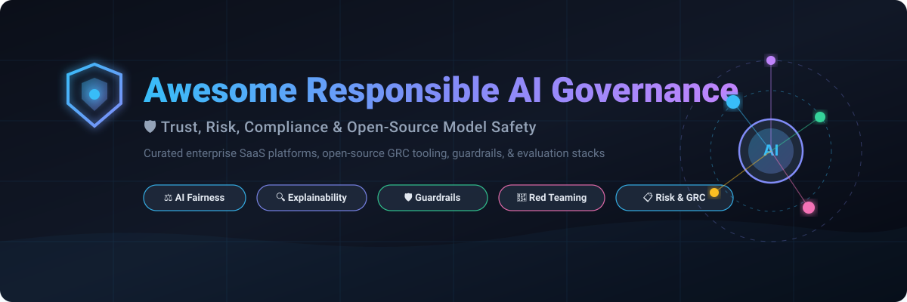
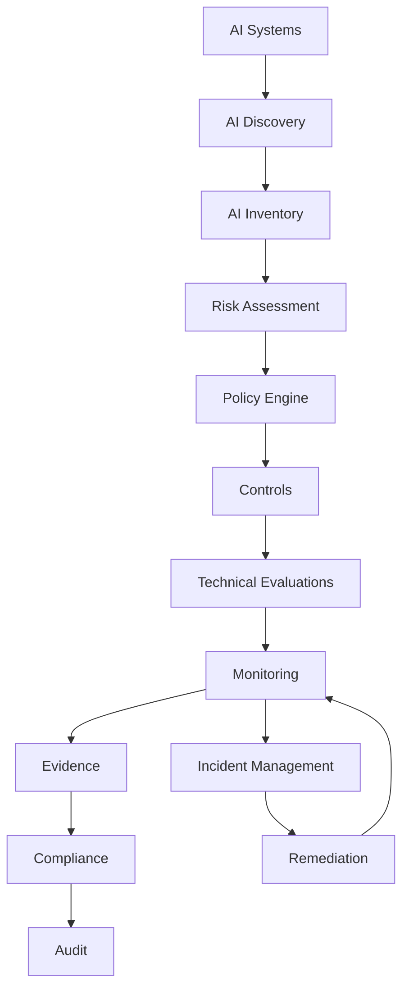
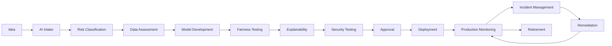

<p align="center">
  <a href="https://github.com/ishandutta2007/Awesome-Responsible-AI-Governance">
    
  </a>
</p>

<p align="center">
  <a href="https://github.com/ishandutta2007/Awesome-Awesome-Awesome"></a><a href="https://discord.gg/jc4xtF58Ve"></a> <a href="https://github.com/ishandutta2007/Awesome-Responsible-AI-Governance/stargazers"></a> <a href="https://github.com/ishandutta2007/Awesome-Responsible-AI-Governance/network/members"></a> <a href="https://github.com/ishandutta2007/Awesome-Responsible-AI-Governance/blob/main/LICENSE"></a> <a href="https://github.com/ishandutta2007"></a>
</p>

# 🛡️ Top Responsible AI Governance Platforms & Open-Source AI Governance


> A curated list of **Responsible AI Governance, AI GRC, model governance, AI risk management, fairness, explainability, evaluation, monitoring, red-teaming, compliance and AI policy platforms** — with a strong emphasis on open-source alternatives.


Responsible AI Governance is the organizational and technical layer used to ensure that AI systems are:


* **Safe**

* **Fair**

* **Transparent**

* **Explainable**

* **Accountable**

* **Privacy-preserving**

* **Secure**

* **Auditable**

* **Compliant**

* **Human-centered**


The commercial AI governance market includes platforms such as **Credo AI, Holistic AI, Monitaur, Fairly AI / Asenion, Trustible, Saidot, Fiddler AI, Arthur AI, CalypsoAI and ModelOp**.


However, there is currently **no single open-source project that completely reproduces the full functionality of a commercial AI Governance platform**.


Instead, an open-source Responsible AI stack is normally assembled from several layers:


```text

AI Inventory

     +

Risk Assessment

     +

Policy Management

     +

Model Registry

     +

Fairness Testing

     +

Explainability

     +

Security / Red Teaming

     +

Model Monitoring

     +

LLM Evaluation

     +

Guardrails

     +

Lineage

     +

Audit Evidence

     +

Compliance Mapping

     =

Open-Source Responsible AI Governance

```


---


## 📑 Table of Contents


* [☁️ SaaS/Hosted Platforms](#️-saashosted-platforms)

* [🌍 Open-Source](#-open-source)

* [🏛️ Open-Source AI Governance Platforms](#️-open-source-ai-governance-platforms)

* [📋 Open-Source AI Risk & Compliance](#-open-source-ai-risk--compliance)

* [⚖️ Open-Source Fairness & Bias](#️-open-source-fairness--bias)

* [🔍 Open-Source Explainability](#-open-source-explainability)

* [📊 Open-Source Model Monitoring](#-open-source-model-monitoring)

* [🧪 Open-Source AI Evaluation](#-open-source-ai-evaluation)

* [🔴 Open-Source AI Red Teaming](#-open-source-ai-red-teaming)

* [🛡️ Open-Source AI Guardrails](#️-open-source-ai-guardrails)

* [🔐 Open-Source Privacy & PII Protection](#-open-source-privacy--pii-protection)

* [🧬 Open-Source Data & Model Lineage](#-open-source-data--model-lineage)

* [📦 Open-Source Model Governance & Registries](#-open-source-model-governance--registries)

* [📑 Open-Source Documentation & Transparency](#-open-source-documentation--transparency)

* [🤖 Open-Source Agent Governance](#-open-source-agent-governance)

* [🧩 Commercial Platform → Open-Source Equivalent](#-commercial-platform--open-source-equivalent)

* [🏗️ Responsible AI Governance Architecture](#️-responsible-ai-governance-architecture)

* [🔄 Open-Source AI Governance Architecture](#-open-source-ai-governance-architecture)

* [⚖️ Commercial vs Open-Source](#️-commercial-vs-open-source)

* [🚀 Recommended Open-Source Stacks](#-recommended-open-source-stacks)

* [📊 Responsible AI Technology Comparison](#-responsible-ai-technology-comparison)

* [🎯 Recommended Projects by Use Case](#-recommended-projects-by-use-case)

* [🏢 Building a Credo AI Alternative](#-building-a-credo-ai-alternative)

* [🧠 Building an Open-Source AI Governance Platform](#-building-an-open-source-ai-governance-platform)

* [🌐 Open-Source Responsible AI Landscape](#-open-source-responsible-ai-landscape)

* [🧠 Why Open-Source Responsible AI Matters](#-why-open-source-responsible-ai-matters)

* [🤝 Contributing](#-contributing)

* [⚠️ Disclaimer](#️-disclaimer)


---


# ☁️ SaaS/Hosted Platforms


Commercial AI governance platforms provide centralized AI inventories, risk assessments, policy management, compliance workflows, monitoring, audit evidence and lifecycle governance.


> **Market Size & Landscape Dynamics (2026):** The global AI Governance, Risk, and Compliance (GRC) market is estimated at **$1.8B – $2.6B in 2026** (projected to reach $8B+ by 2030 at a 35%+ CAGR), propelled by strict regulatory enforcement worldwide (EU AI Act, NIST AI RMF, ISO/IEC 42001). The sector is currently **moderately fragmented**: enterprise IT giants (IBM, SAP, ServiceNow) lead horizontal IT compliance ecosystems, while high-velocity specialized AI pure-plays (Credo AI, Holistic AI, Fiddler AI, Modulos) provide deep domain moats across automated red teaming, fairness audits, and continuous LLM guardrails.

| Platform | Company | Company Scale (Rev / Valuation) | Primary Focus | Key Capabilities | Pricing | Free Tier Limits |
| --- | --- | --- | --- | --- | --- | --- |
| [IBM watsonx.governance](https://www.ibm.com/products/watsonx-governance) | IBM | Mega Enterprise (~$62B+ Revenue / ~$190B+ Market Cap) | Enterprise AI Governance | Model governance, AI inventory, risk, compliance, factsheets and lifecycle workflows | Essentials tier from $0.64/Resource Unit; Risk & Compliance starting at ~$3,500/month | Free "Lite" plan available on IBM Cloud: up to 200 Resource Units (RUs), 1,000 records per evaluation, 3 use cases, 1 inventory, 100 MB internal PostgreSQL database |
| [SAP LeanIX AI Governance](https://www.sap.com/products/leanix.html) | SAP | Mega Enterprise (~$35B+ Revenue / ~$240B+ Market Cap) | AI Governance / EA | AI inventory, ownership, architecture and governance | Modular subscription priced by number of applications in portfolio (includes unlimited users) | No self-service free trial; guided product demos and custom evaluations provided by SAP |
| [ServiceNow AI Control Tower](https://www.servicenow.com/) | ServiceNow | Mega Enterprise (~$10B+ Revenue / ~$180B+ Market Cap) | Enterprise AI Governance | AI inventory, lifecycle, risk, compliance and workflow | Bundled into ServiceNow AI-native tiers (Foundation, Advanced, Prime) with consumption metered per AI "assist" | No separate free tier; available within ServiceNow trial instances or enterprise POC environments |
| [CalypsoAI](https://www.calypsoai.com/) | CalypsoAI (F5) | Enterprise Division (F5 ~$2.8B Revenue / ~$15B Market Cap) | AI Security & Governance | AI security, model governance, GenAI security, policy and monitoring | Enterprise contract via F5 / AWS Marketplace (annual contracts typically baseline ~$100,000/year depending on scope) | No self-service free tier or public trial; private enterprise POCs and live demos available via F5 |
| [OneTrust AI Governance](https://www.onetrust.com/) | OneTrust | Large Enterprise / Unicorn (~$400M+ ARR / ~$5.3B Valuation) | AI GRC | AI inventory, risk, privacy, compliance and governance | Standalone modules starting at ~$50,000/year (metered by admin users and AI inventory asset count) | No self-service free tier or public trial; custom enterprise sandbox demos provided during vendor evaluation |
| [Arize AI](https://arize.com/) | Arize | Late-Stage Growth (~$40M+ ARR / ~$500M+ Valuation) | AI Observability | Model monitoring, evaluation, tracing and LLM observability | $50/month (AX Pro tier for 100,000 spans/month and 100 GB data ingestion; Enterprise custom) | Free tier available (AX Free): up to 25,000 trace spans/month, 1 GB data ingestion/month, 7-day retention, 1 user; Arize Phoenix is free and open source |
| [Fiddler AI](https://www.fiddler.ai/) | Fiddler AI | Mid-Stage Venture (~$20M+ ARR / ~$250M Valuation) | AI Observability & Governance | Model monitoring, explainability, evaluation, GenAI observability, guardrails and governance | $0.002/trace (Developer usage tier; Enterprise custom tier available) | Free tier available: real-time Centor guardrails (<80ms latency for toxicity, PII/PHI, prompt injection, hallucinations); observability features require Developer/Enterprise tier |
| [Credo AI](https://www.credo.ai/) | Credo AI | Mid-Stage Venture (~$15M+ ARR / ~$150M Valuation) | AI Governance | AI inventory, risk, policy packs, regulatory mapping, controls, evidence and agent governance | Starts at ~$30,000/year (enterprise contract based on managed AI use cases) | No free tier or self-service trial; free public AI Governance Insights Hub and demo available upon request |
| [Holistic AI](https://www.holisticai.com/) | Holistic AI | Growth Stage (~$12M+ ARR / ~$120M Valuation) | AI Governance & Assurance | AI discovery, risk assessment, bias testing, red teaming, monitoring and policy enforcement | Quote-based enterprise subscription (typically varies by scope, starting tiers tailored to compliance needs) | No self-service free tier; guided pilot projects and live demos available upon consultation |
| [ModelOp](https://www.modelop.com/) | ModelOp | Growth Stage (~$10M+ ARR / ~$100M Valuation) | ModelOps & AI Governance | AI inventory, lifecycle governance, risk, controls, approvals and enterprise AI oversight | Annual subscription license (priced by volume of managed AI models/solutions) | No public free tier or free trial; product tours and tailored sandbox demos available on request |
| [Arthur AI](https://www.arthur.ai/) | Arthur | Growth Stage (~$8M+ ARR / ~$80M Valuation) | AI Observability & Governance | Model monitoring, AI evaluations, explainability, policies and agent governance | $60/month (Premium tier up to 100 use cases; Enterprise custom) | Free tier available ($0/month): up to 4 use cases with core metrics and cloud data connectors; Arthur Bench open-source evaluation engine is free |
| [LatticeFlow AI](https://latticeflow.ai/) | LatticeFlow | Series A (~$6M+ ARR / ~$60M Valuation) | AI Quality & Governance | AI quality, data/model testing, risk and compliance | Enterprise annual subscription based on number of models and regulatory audit scope | 30-day guided AI governance trial available upon sales inquiry; no self-service free tier |
| [Aporia](https://www.aporia.com/) | Aporia | Series A (~$5M+ ARR / ~$50M Valuation) | ML Monitoring | Model monitoring, drift, performance, bias and explainability | Custom usage-based pricing per model in production (historical base tiers from $99/month; AWS Marketplace private offers) | Community Free plan: 1 monitored model, 10,000 predictions/month, 100 features/model, 3 team members, 1-week retention; 14-day free trial for paid features (no credit card required) |
| [Trustible](https://trustible.com/) | Trustible | Early Stage (~$3M+ ARR / ~$35M Valuation) | AI GRC | AI inventory, risk scoring, vendor assessment, controls and audit evidence | Custom annual subscription (metered by managed AI systems and assessment modules) | No free trial; free access to open-source AI Governance Insights Center and risk taxonomies |
| [Saidot](https://www.saidot.ai/) | Saidot | Early Stage (~$3M+ ARR / ~$30M Valuation) | AI Governance | Governance knowledge graph, policies, risks, controls, datasets, models and transparency | Tiered subscription based on AI assets and seats (typically billed annually in EUR/USD) | No permanent free tier; facilitated pilot project and trial environment provided upon request |
| [Modulos](https://www.modulos.ai/) | Modulos | Early Stage (~$2.5M+ ARR / ~$25M Valuation) | AI Governance | AI governance, risk, compliance and model lifecycle | Paid tiers starting at ~$50,000/year (priced by number of AI systems governed) | Free Starter Plan available: free for 1 AI-app project and 1 user with mapping for EU AI Act / ISO 42001 / NIST AI RMF |
| [Monitaur](https://www.monitaur.ai/) | Monitaur | Early Stage (~$2M+ ARR / ~$20M Valuation) | Model Governance | Model governance, model risk, lifecycle management, evidence and regulated-industry governance | Custom subscription per model/module (enterprise agreements typically start on an annual basis) | No free tier or public trial; interactive demos and free access to AI Trust Library resources provided |
| [Superwise](https://www.superwise.ai/) | Superwise | Early Stage (~$2M+ ARR / ~$20M Valuation) | Model Governance & Monitoring | Model monitoring, drift, bias and operational risk | $10/month (Solo tier, 1 Sentinel deployment; Pro at $25/month up to 5 Sentinels) | Free Forever Starter tier: 1 agent and 1 dataset with real-time observability and guardrails; 30-day free trial on paid tiers (no credit card required) |
| [Asenion](https://www.asenion.com/) | Asenion / formerly Fairly AI | Early Stage (~$1.5M+ ARR / ~$15M Valuation) | AI GRC | AI governance, risk, compliance and assurance | Starts at $99/month (basic SMB tier; enterprise plans scaled per AI application) | No permanent free tier; 30-day proof-of-concept (POC) trial or 30-day money-back guarantee |


Credo AI currently positions its platform around AI discovery, inventory, risk, policy and evidence across models, applications, agents and vendors.


Holistic AI similarly positions its platform around discovery, testing, continuous monitoring and policy enforcement across AI systems and agents.


---


# 🌍 Open-Source


The open-source Responsible AI ecosystem is much more **modular** than the commercial AI Governance market.


```text

                    RESPONSIBLE AI

                          │

       ┌──────────────────┼──────────────────┐

       │                  │                  │

       ▼                  ▼                  ▼

    Governance          Technical          Runtime

       │                Assurance           Controls

       │                  │                  │

       ▼                  ▼                  ▼

    Inventory          Fairness          Guardrails

    Risk               Explainability    Privacy

    Policies           Evaluation        Security

    Compliance         Monitoring        Policy

    Evidence           Red Teaming       Enforcement

```


The strongest open-source approach is therefore usually to **compose several specialized projects**.


---


# 🏛️ Open-Source AI Governance Platforms


There are relatively few genuinely open-source projects that attempt to provide a complete governance platform.


| Project | Stars | Focus | Status |
| --- | :---: | --- | :---: |
| [MLflow](https://github.com/mlflow/mlflow) | [](https://github.com/mlflow/mlflow/stargazers) | ML lifecycle and model governance | 🟢 Open Source |
| [Kubeflow](https://github.com/kubeflow/kubeflow) | [](https://github.com/kubeflow/kubeflow/stargazers) | ML lifecycle infrastructure | 🟢 Open Source |
| [Open Policy Agent](https://github.com/open-policy-agent/opa) | [](https://github.com/open-policy-agent/opa/stargazers) | Policy-as-code & guardrails | 🟢 Open Source |
| [Evidently](https://github.com/evidentlyai/evidently) | [](https://github.com/evidentlyai/evidently/stargazers) | AI evaluation, drift, and monitoring | 🟢 Open Source |
| [Giskard](https://github.com/Giskard-AI/giskard) | [](https://github.com/Giskard-AI/giskard/stargazers) | AI quality, testing and risk | 🟢 Open Source |
| [Deepchecks](https://github.com/deepchecks/deepchecks) | [](https://github.com/deepchecks/deepchecks/stargazers) | ML validation and continuous integrity | 🟢 Open Source |
| [AIF360](https://github.com/Trusted-AI/AIF360) | [](https://github.com/Trusted-AI/AIF360/stargazers) | Fairness and bias assessment | 🟢 Open Source |
| [Fairlearn](https://github.com/fairlearn/fairlearn) | [](https://github.com/fairlearn/fairlearn/stargazers) | Fairness assessment and mitigation | 🟢 Open Source |
| [Inspect AI](https://github.com/UKGovernmentBEIS/inspect_ai) | [](https://github.com/UKGovernmentBEIS/inspect_ai/stargazers) | AI evaluation & safety benchmarks | 🟢 Open Source |
| [AI Verify](https://github.com/aisingapore/ai-verify) | [](https://github.com/aisingapore/ai-verify/stargazers) | AI governance testing and assurance | 🟢 Open Source |
| [NIST Dioptra](https://github.com/usnistgov/dioptra) | [](https://github.com/usnistgov/dioptra/stargazers) | AI testing / risk assessment | 🟢 Open Source |
| [AI Verify Project](https://aiverifyfoundation.sg/) | 🌐 Framework | Responsible AI testing ecosystem | 🟢 Open Source |


> **Important:** these projects do not all attempt to be full AI Governance platforms. Together, however, they provide many of the technical components required to build one.


---


# 📋 Open-Source AI Risk & Compliance


Responsible AI governance requires converting policies and regulations into operational controls.


```text

Regulation

    │

    ▼

Governance Framework

    │

    ▼

Policy

    │

    ▼

Risk

    │

    ▼

Control

    │

    ▼

Technical Test

    │

    ▼

Evidence

    │

    ▼

Audit

```


| Project | Stars | Role |
| --- | :---: | --- |
| [MLflow](https://github.com/mlflow/mlflow) | [](https://github.com/mlflow/mlflow/stargazers) | Model lifecycle, metadata, and governance |
| [Kubeflow](https://github.com/kubeflow/kubeflow) | [](https://github.com/kubeflow/kubeflow/stargazers) | ML lifecycle orchestration and pipelines |
| [Open Policy Agent](https://github.com/open-policy-agent/opa) | [](https://github.com/open-policy-agent/opa/stargazers) | Policy-as-code and automated admission |
| [Kyverno](https://github.com/kyverno/kyverno) | [](https://github.com/kyverno/kyverno/stargazers) | Kubernetes native policy engine |
| [Giskard](https://github.com/Giskard-AI/giskard) | [](https://github.com/Giskard-AI/giskard/stargazers) | AI quality and risk testing |
| [Gatekeeper](https://github.com/open-policy-agent/gatekeeper) | [](https://github.com/open-policy-agent/gatekeeper/stargazers) | OPA Kubernetes policy enforcement |
| [OpenLineage](https://github.com/OpenLineage/OpenLineage) | [](https://github.com/OpenLineage/OpenLineage/stargazers) | Open standard for data / pipeline lineage |
| [Marquez](https://github.com/MarquezProject/marquez) | [](https://github.com/MarquezProject/marquez/stargazers) | Lineage metadata service and audit catalog |
| [AI Verify](https://github.com/aisingapore/ai-verify) | [](https://github.com/aisingapore/ai-verify/stargazers) | Responsible AI testing framework |
| [NIST Dioptra](https://github.com/usnistgov/dioptra) | [](https://github.com/usnistgov/dioptra/stargazers) | AI risk testing, adversarial evaluation |


---


# ⚖️ Open-Source Fairness & Bias


Fairness is one of the most mature areas of open-source Responsible AI tooling.


```text

Dataset

   │

   ▼

Protected Attributes

   │

   ▼

Model Predictions

   │

   ▼

Fairness Metrics

   │

   ├── Demographic Parity

   ├── Equal Opportunity

   ├── Equalized Odds

   ├── Disparate Impact

   └── Group Performance

   │

   ▼

Mitigation

```


| Project | Stars | Description |
| --- | :---: | --- |
| [AI Fairness 360](https://github.com/Trusted-AI/AIF360) | [](https://github.com/Trusted-AI/AIF360/stargazers) | Comprehensive fairness metrics & mitigation toolkit |
| [Fairlearn](https://github.com/fairlearn/fairlearn) | [](https://github.com/fairlearn/fairlearn/stargazers) | Fairness assessment and disparity mitigation |
| [Responsible AI Toolbox](https://github.com/microsoft/responsible-ai-toolbox) | [](https://github.com/microsoft/responsible-ai-toolbox/stargazers) | Integrated fairness, interpretability & error analysis |
| [What-If Tool](https://github.com/PAIR-code/what-if-tool) | [](https://github.com/PAIR-code/what-if-tool/stargazers) | Interactive model analysis and fairness probes |
| [Aequitas](https://github.com/dssg/aequitas) | [](https://github.com/dssg/aequitas/stargazers) | Comprehensive bias & fairness auditing toolkit |
| [Fairness Indicators](https://github.com/tensorflow/fairness-indicators) | [](https://github.com/tensorflow/fairness-indicators/stargazers) | TF fairness evaluation and subgroup analysis |
| [Themis-ML](https://github.com/cosmicBboy/themis-ml) | [](https://github.com/cosmicBboy/themis-ml/stargazers) | Fairness-aware machine learning library |


Fairlearn provides fairness assessment and mitigation methods, while AIF360 provides fairness metrics and bias-mitigation algorithms.


---


# 🔍 Open-Source Explainability


Explainability helps organizations understand **why a model produced a particular output**.


```text

Model

  │

  ▼

Prediction

  │

  ▼

Explanation Engine

  │

  ├── Feature Importance

  ├── Local Explanation

  ├── Global Explanation

  ├── Counterfactuals

  └── Attribution

```


| Project | Stars | Description |
| --- | :---: | --- |
| [SHAP](https://github.com/shap/shap) | [](https://github.com/shap/shap/stargazers) | Game-theoretic Shapley-based explanations |
| [LIME](https://github.com/marcotcr/lime) | [](https://github.com/marcotcr/lime/stargazers) | Local Interpretable Model-agnostic Explanations |
| [InterpretML](https://github.com/interpretml/interpret) | [](https://github.com/interpretml/interpret/stargazers) | Explainable boosting machines & interpretability |
| [Captum](https://github.com/pytorch/captum) | [](https://github.com/pytorch/captum/stargazers) | PyTorch model interpretability and attribution |
| [ELI5](https://github.com/TeamHG-Memex/eli5) | [](https://github.com/TeamHG-Memex/eli5/stargazers) | Model inspection, debugging, and text attribution |
| [Alibi](https://github.com/SeldonIO/alibi) | [](https://github.com/SeldonIO/alibi/stargazers) | Explainability, counterfactuals, and outlier detection |
| [Responsible AI Toolbox](https://github.com/microsoft/responsible-ai-toolbox) | [](https://github.com/microsoft/responsible-ai-toolbox/stargazers) | Holistic explainability & model performance dashboards |
| [What-If Tool](https://github.com/PAIR-code/what-if-tool) | [](https://github.com/PAIR-code/what-if-tool/stargazers) | Interactive counterfactual analysis |


---


# 📊 Open-Source Model Monitoring


Governance cannot stop when a model reaches production.


```text

Development

     │

     ▼

Validation

     │

     ▼

Deployment

     │

     ▼

Production

     │

     ▼

Monitoring

     │

 ┌───┼────────────┐

 ▼   ▼            ▼

Drift Bias      Quality

 │   │            │

 └───┼────────────┘

     ▼

Risk Alert

     │

     ▼

Governance Review

```


| Project | Stars | Description |
| --- | :---: | --- |
| [Grafana](https://github.com/grafana/grafana) | [](https://github.com/grafana/grafana/stargazers) | Monitoring dashboards, observability UI, and alerts |
| [Prometheus](https://github.com/prometheus/prometheus) | [](https://github.com/prometheus/prometheus/stargazers) | Time-series metrics infrastructure and scraper |
| [MLflow](https://github.com/mlflow/mlflow) | [](https://github.com/mlflow/mlflow/stargazers) | Model lifecycle, registry, and production monitoring integrations |
| [Evidently](https://github.com/evidentlyai/evidently) | [](https://github.com/evidentlyai/evidently/stargazers) | Production ML & LLM drift, quality, and monitoring dashboards |
| [whylogs](https://github.com/whylabs/whylogs) | [](https://github.com/whylabs/whylogs/stargazers) | Statistical data profiling and lightweight telemetry |
| [Deepchecks](https://github.com/deepchecks/deepchecks) | [](https://github.com/deepchecks/deepchecks/stargazers) | Continuous model validation, integrity, and test suites |
| [NannyML](https://github.com/NannyML/nannyml) | [](https://github.com/NannyML/nannyml/stargazers) | Post-deployment performance estimation without ground truth |
| [Alibi Detect](https://github.com/SeldonIO/alibi-detect) | [](https://github.com/SeldonIO/alibi-detect/stargazers) | Real-time drift, outlier, and adversarial attack detection |


Evidently describes itself as an open-source framework for evaluating, testing and monitoring ML and LLM systems, including offline evaluation and live monitoring.


---


# 🧪 Open-Source AI Evaluation


Evaluation is increasingly becoming one of the most important technical components of AI governance.


| Project | Stars | Focus |
| --- | :---: | --- |
| [OpenAI Evals](https://github.com/openai/evals) | [](https://github.com/openai/evals/stargazers) | Model evaluation framework and benchmark suites |
| [Ragas](https://github.com/explodinggradients/ragas) | [](https://github.com/explodinggradients/ragas/stargazers) | RAG pipeline evaluation & metric generation |
| [lm-evaluation-harness](https://github.com/EleutherAI/lm-evaluation-harness) | [](https://github.com/EleutherAI/lm-evaluation-harness/stargazers) | Standardized LLM few-shot benchmarking |
| [Evidently](https://github.com/evidentlyai/evidently) | [](https://github.com/evidentlyai/evidently/stargazers) | LLM evaluation, quality metrics, and monitoring |
| [DeepEval](https://github.com/confident-ai/deepeval) | [](https://github.com/confident-ai/deepeval/stargazers) | Production LLM unit testing and evaluators |
| [promptfoo](https://github.com/promptfoo/promptfoo) | [](https://github.com/promptfoo/promptfoo/stargazers) | LLM prompt testing, security evals, and CI/CD assertions |
| [Giskard](https://github.com/Giskard-AI/giskard) | [](https://github.com/Giskard-AI/giskard/stargazers) | LLM hallucination and vulnerability testing |
| [Inspect AI](https://github.com/UKGovernmentBEIS/inspect_ai) | [](https://github.com/UKGovernmentBEIS/inspect_ai/stargazers) | AI safety, red teaming & evaluation framework |
| [DeepTeam](https://github.com/confident-ai/deepteam) | [](https://github.com/confident-ai/deepteam/stargazers) | Automated LLM red teaming and vulnerability probing |
| [NIST Dioptra](https://github.com/usnistgov/dioptra) | [](https://github.com/usnistgov/dioptra/stargazers) | Adversarial AI testing & risk benchmarking |


---


# 🔴 Open-Source AI Red Teaming


Responsible AI governance increasingly requires adversarial testing.


```text

                  AI SYSTEM

                      │

          ┌───────────┼───────────┐

          ▼           ▼           ▼

       Jailbreak    Prompt      Data

        Tests       Injection   Leakage

          │           │           │

          └───────────┼───────────┘

                      ▼

                 Red Teaming

                      │

                      ▼

                Risk Findings

                      │

                      ▼

                 Remediation

```


| Project | Stars | Description |
| --- | :---: | --- |
| [promptfoo](https://github.com/promptfoo/promptfoo) | [](https://github.com/promptfoo/promptfoo/stargazers) | Automated LLM red teaming, jailbreak testing & security |
| [Adversarial Robustness Toolbox](https://github.com/Trusted-AI/adversarial-robustness-toolbox) | [](https://github.com/Trusted-AI/adversarial-robustness-toolbox/stargazers) | Comprehensive library for adversarial ML attacks & defenses |
| [NVIDIA NeMo Guardrails](https://github.com/NVIDIA-NeMo/NeMo-Guardrails) | [](https://github.com/NVIDIA-NeMo/NeMo-Guardrails/stargazers) | Programmable LLM jailbreak prevention and safety controls |
| [Garak](https://github.com/NVIDIA/garak) | [](https://github.com/NVIDIA/garak/stargazers) | Comprehensive LLM vulnerability and red-team scanner |
| [TextAttack](https://github.com/QData/TextAttack) | [](https://github.com/QData/TextAttack/stargazers) | NLP adversarial attacks, data augmentation, and robustness |
| [PyRIT](https://github.com/Azure/PyRIT) | [](https://github.com/Azure/PyRIT/stargazers) | Microsoft Python Risk Identification Toolkit for GenAI |
| [Inspect AI](https://github.com/UKGovernmentBEIS/inspect_ai) | [](https://github.com/UKGovernmentBEIS/inspect_ai/stargazers) | Safety and security evaluation for LLMs and agents |
| [Counterfit](https://github.com/Azure/counterfit) | [](https://github.com/Azure/counterfit/stargazers) | Automation tool for security assessments of ML models |
| [DeepTeam](https://github.com/confident-ai/deepteam) | [](https://github.com/confident-ai/deepteam/stargazers) | Red-teaming toolkit for LLMs and agent safety |


---


# 🛡️ Open-Source AI Guardrails


Governance becomes substantially more powerful when policies can be enforced at runtime.


```text

User

 │

 ▼

AI Gateway

 │

 ▼

Policy Engine

 │

 ├── Content Policy

 ├── PII Policy

 ├── Safety Policy

 ├── Access Policy

 ├── Tool Policy

 └── Compliance Policy

 │

 ▼

Model / Agent

 │

 ▼

Output Guardrail

 │

 ▼

User

```


| Project | Stars | Description |
| --- | :---: | --- |
| [LiteLLM](https://github.com/BerriAI/litellm) | [](https://github.com/BerriAI/litellm/stargazers) | Universal LLM proxy, budget limits, rate limiting & guardrails |
| [Open Policy Agent](https://github.com/open-policy-agent/opa) | [](https://github.com/open-policy-agent/opa/stargazers) | General-purpose policy engine for runtime AI decision rules |
| [Guardrails AI](https://github.com/guardrails-ai/guardrails) | [](https://github.com/guardrails-ai/guardrails/stargazers) | Output validation, structured response enforcement, and PII shields |
| [Microsoft Presidio](https://github.com/microsoft/presidio) | [](https://github.com/microsoft/presidio/stargazers) | Context-aware PII detection and anonymization guardrail |
| [NeMo Guardrails](https://github.com/NVIDIA-NeMo/NeMo-Guardrails) | [](https://github.com/NVIDIA-NeMo/NeMo-Guardrails/stargazers) | Programmable Colang guardrails for LLM safety and topic adherence |
| [LLM Guard](https://github.com/protectai/llm-guard) | [](https://github.com/protectai/llm-guard/stargazers) | Security, sanitization, and privacy scanners for LLM I/O |
| [Llama Guard](https://github.com/meta-llama/PurpleLlama) | [](https://github.com/meta-llama/PurpleLlama/stargazers) | Meta safety classifier for LLM input and output safety checks |


---


# 🔐 Open-Source Privacy & PII Protection


Responsible AI programs need controls over sensitive information.


| Project | Stars | Description |
| --- | :---: | --- |
| [Open Policy Agent](https://github.com/open-policy-agent/opa) | [](https://github.com/open-policy-agent/opa/stargazers) | Fine-grained data access and privacy policy enforcement |
| [Microsoft Presidio](https://github.com/microsoft/presidio) | [](https://github.com/microsoft/presidio/stargazers) | Production-grade PII detection and anonymization SDK |
| [SDV](https://github.com/sdv-dev/SDV) | [](https://github.com/sdv-dev/SDV/stargazers) | Synthetic Data Vault for privacy-preserving data sharing |
| [Opacus](https://github.com/pytorch/opacus) | [](https://github.com/pytorch/opacus/stargazers) | High-speed differential privacy library for PyTorch |
| [synthcity](https://github.com/vanderschaarlab/synthcity) | [](https://github.com/vanderschaarlab/synthcity/stargazers) | Synthetic data generation library for privacy and fairness |
| [OpenDP](https://github.com/opendp/opendp) | [](https://github.com/opendp/opendp/stargazers) | Modular statistical collection for differential privacy |
| [ARX](https://github.com/arx-deidentifier/arx) | [](https://github.com/arx-deidentifier/arx/stargazers) | Comprehensive biomedical data anonymization tool |


---


# 🧬 Open-Source Data & Model Lineage


Governance requires knowing:


```text

Where did this model come from?

             │

             ▼

What data trained it?

             │

             ▼

Which version was deployed?

             │

             ▼

Which application uses it?

             │

             ▼

Who approved it?

             │

             ▼

What happened in production?

```


| Project | Stars | Role |
| --- | :---: | --- |
| [DVC](https://github.com/iterative/dvc) | [](https://github.com/iterative/dvc/stargazers) | Git-native data, ML pipeline, and model versioning |
| [DataHub](https://github.com/datahub-project/datahub) | [](https://github.com/datahub-project/datahub/stargazers) | Enterprise metadata catalog, lineage, and data governance |
| [OpenMetadata](https://github.com/open-metadata/OpenMetadata) | [](https://github.com/open-metadata/OpenMetadata/stargazers) | Centralized metadata platform for discovery and lineage |
| [LakeFS](https://github.com/treeverse/lakeFS) | [](https://github.com/treeverse/lakeFS/stargazers) | Git-like version control for data lakes and object stores |
| [Amundsen](https://github.com/amundsen-io/amundsen) | [](https://github.com/amundsen-io/amundsen/stargazers) | Metadata engine for data discovery and asset inspection |
| [OpenLineage](https://github.com/OpenLineage/OpenLineage) | [](https://github.com/OpenLineage/OpenLineage/stargazers) | Open standard for metadata collection and operational lineage |
| [Marquez](https://github.com/MarquezProject/marquez) | [](https://github.com/MarquezProject/marquez/stargazers) | OpenLineage reference server and visualization backend |


---


# 📦 Open-Source Model Governance & Registries


A governance platform needs a central inventory of models and AI systems.


| Project | Stars | Description |
| --- | :---: | --- |
| [MLflow Model Registry](https://github.com/mlflow/mlflow) | [](https://github.com/mlflow/mlflow/stargazers) | Centralized model lifecycle management, approvals, and lineage |
| [Kubeflow](https://github.com/kubeflow/kubeflow) | [](https://github.com/kubeflow/kubeflow/stargazers) | Cloud-native ML orchestration platform on Kubernetes |
| [BentoML](https://github.com/bentoml/BentoML) | [](https://github.com/bentoml/BentoML/stargazers) | Unified model serving, packaging, and deployment framework |
| [ClearML](https://github.com/clearml/clearml) | [](https://github.com/clearml/clearml/stargazers) | End-to-end MLOps suite for experiment tracking and governance |
| [Feast](https://github.com/feast-dev/feast) | [](https://github.com/feast-dev/feast/stargazers) | Feature store for managing training and serving consistency |
| [KServe](https://github.com/kserve/kserve) | [](https://github.com/kserve/kserve/stargazers) | Standardized serverless ML inference on Kubernetes |
| [Seldon Core](https://github.com/SeldonIO/seldon-core) | [](https://github.com/SeldonIO/seldon-core/stargazers) | Advanced ML deployment, monitoring, and traffic governance |
| [ModelDB](https://github.com/VertaAI/modeldb) | [](https://github.com/VertaAI/modeldb/stargazers) | Open-source system for managing machine learning models |


---


# 📑 Open-Source Documentation & Transparency


Responsible AI governance needs standardized documentation.


| Project / Standard                                                           | Purpose                           |

| ---------------------------------------------------------------------------- | --------------------------------- |

| [Model Cards Toolkit](https://github.com/tensorflow/model-card-toolkit)      | Model documentation               |

| [Datasheets for Datasets](https://arxiv.org/abs/1803.09010)                  | Dataset documentation methodology |

| [Data Cards](https://github.com/IBM/data-prep-kit)                           | Dataset transparency              |

| [MLflow](https://github.com/mlflow/mlflow)                                   | Experiment/model metadata         |

| [Hugging Face Model Cards](https://huggingface.co/docs/hub/model-cards)      | Model transparency                |

| [Hugging Face Dataset Cards](https://huggingface.co/docs/hub/datasets-cards) | Dataset transparency              |


---


# 🤖 Open-Source Agent Governance


Agentic AI introduces a new governance problem because agents can **take actions**, rather than merely generate outputs.


```text

                    AI AGENT

                       │

              ┌────────┼────────┐

              ▼        ▼        ▼

            Tools     APIs    Databases

              │        │        │

              └────────┼────────┘

                       ▼

                 External Action

```


Governance therefore needs:


* Agent inventory

* Identity

* Tool permissions

* Data permissions

* Action policies

* Human approval

* Audit logs

* Rate limits

* Kill switches

* Runtime monitoring


| Project | Stars | Useful Capability |
| --- | :---: | --- |
| [AutoGen](https://github.com/microsoft/autogen) | [](https://github.com/microsoft/autogen/stargazers) | Multi-agent framework with customizable conversation boundaries |
| [CrewAI](https://github.com/crewAIInc/crewAI) | [](https://github.com/crewAIInc/crewAI/stargazers) | Role-based autonomous agent orchestration & execution controls |
| [LangGraph](https://github.com/langchain-ai/langgraph) | [](https://github.com/langchain-ai/langgraph/stargazers) | Deterministic cyclic agent graphs, human-in-the-loop approvals |
| [Open Policy Agent](https://github.com/open-policy-agent/opa) | [](https://github.com/open-policy-agent/opa/stargazers) | Fine-grained tool invocation authorization & sandbox security |
| [Guardrails AI](https://github.com/guardrails-ai/guardrails) | [](https://github.com/guardrails-ai/guardrails/stargazers) | Action validation, schema verification, and hallucination checks |
| [NeMo Guardrails](https://github.com/NVIDIA-NeMo/NeMo-Guardrails) | [](https://github.com/NVIDIA-NeMo/NeMo-Guardrails/stargazers) | Agent intent verification and off-topic prevention |
| [PyRIT](https://github.com/Azure/PyRIT) | [](https://github.com/Azure/PyRIT/stargazers) | Automated red teaming for agent loops and multi-step actions |
| [Inspect AI](https://github.com/UKGovernmentBEIS/inspect_ai) | [](https://github.com/UKGovernmentBEIS/inspect_ai/stargazers) | Comprehensive benchmarking for autonomous agent safety |


---


# 🧩 Commercial Platform → Open-Source Equivalent


| Commercial Platform             | Open-Source Equivalent / Building Blocks                                   |

| ------------------------------- | -------------------------------------------------------------------------- |

| **Credo AI**                    | MLflow + Open Policy Agent + Fairlearn + Evidently + Giskard + OpenLineage |

| **Holistic AI**                 | AI Verify + Fairlearn + Giskard + PyRIT + Evidently                        |

| **Monitaur**                    | MLflow + OpenLineage + Model Cards + OPA + Evidently                       |

| **Fairly AI / Asenion**         | AI Verify + Fairlearn + AIF360 + Giskard + OPA                             |

| **Trustible**                   | MLflow + OpenMetadata + OPA + OpenLineage + AI Verify                      |

| **Saidot**                      | OpenMetadata + MLflow + OPA + Model Cards + compliance knowledge base      |

| **Fiddler AI**                  | Evidently + SHAP + Alibi Detect + Prometheus + Grafana                     |

| **Arthur AI**                   | Evidently + Alibi Detect + SHAP + OpenTelemetry + OPA                      |

| **CalypsoAI**                   | NeMo Guardrails + LLM Guard + Presidio + PyRIT + OPA                       |

| **ModelOp**                     | MLflow + Kubeflow + OpenLineage + OPA + Evidently                          |

| **IBM watsonx.governance**      | MLflow + Kubeflow + OpenLineage + Fairlearn + OPA                          |

| **OneTrust AI Governance**      | OpenMetadata + OPA + AI Verify + Presidio + OpenLineage                    |

| **ServiceNow AI Control Tower** | OpenMetadata + MLflow + OpenLineage + OPA                                  |

| **Enterprise AI GRC**           | OpenMetadata + MLflow + AI Verify + OPA + Evidence Store                   |

| **AI Model Governance**         | MLflow + Model Cards + OpenLineage + Evidently                             |

| **AI Fairness Platform**        | Fairlearn + AIF360 + Aequitas + Responsible AI Toolbox                     |

| **AI Observability Platform**   | Evidently + OpenTelemetry + Prometheus + Grafana                           |

| **AI Security Governance**      | PyRIT + Garak + LLM Guard + Presidio + OPA                                 |

| **LLM Governance**              | Inspect AI + DeepEval + promptfoo + NeMo Guardrails + Evidently            |

| **Agent Governance**            | OPA + NeMo Guardrails + OpenTelemetry + Inspect AI                         |

| **AI Compliance Platform**      | AI Verify + OPA + MLflow + OpenLineage + Model Cards                       |


---


# 🏗️ Responsible AI Governance Architecture


A commercial governance platform can conceptually be decomposed into:





---


# 🔄 Open-Source AI Governance Architecture


A practical open-source architecture can be assembled as:


```text

                         AI SYSTEMS

                             │

              ┌──────────────┼──────────────┐

              ▼              ▼              ▼

            Models         Agents         Vendors

              │              │              │

              └──────────────┼──────────────┘

                             ▼

                       AI INVENTORY

                             │

                         MLflow / DB

                             │

                             ▼

                       RISK ENGINE

                             │

                ┌────────────┼────────────┐

                ▼            ▼            ▼

            Fairness    Security      Privacy

                │            │            │

            Fairlearn      PyRIT       Presidio

            AIF360         Garak       OpenDP

                │            │            │

                └────────────┼────────────┘

                             ▼

                       POLICY ENGINE

                             │

                       Open Policy Agent

                             │

                             ▼

                         EVIDENCE

                             │

              ┌──────────────┼──────────────┐

              ▼              ▼              ▼

          OpenLineage      MLflow       Evidently

              │              │              │

              └──────────────┼──────────────┘

                             ▼

                        AUDIT / GRC

```


---


# 🧪 Responsible AI Lifecycle





---


# 📋 AI Governance Control Matrix


An open-source governance system can map requirements to technical evidence.


| Governance Domain | Example Control             | Open-Source Implementation  |

| ----------------- | --------------------------- | --------------------------- |

| AI Inventory      | Maintain AI system registry | MLflow + OpenMetadata       |

| Ownership         | Assign system owner         | PostgreSQL / OpenMetadata   |

| Risk              | Risk classification         | Custom policy engine        |

| Fairness          | Test protected groups       | Fairlearn / AIF360          |

| Explainability    | Explain decisions           | SHAP / LIME                 |

| Privacy           | Detect PII                  | Presidio                    |

| Security          | Red-team AI                 | PyRIT / Garak               |

| LLM Safety        | Test harmful outputs        | NeMo Guardrails             |

| Drift             | Detect distribution changes | Evidently / Alibi Detect    |

| Data Lineage      | Track datasets              | OpenLineage                 |

| Model Lineage     | Track model versions        | MLflow                      |

| Documentation     | Model cards                 | Model Card Toolkit          |

| Policy            | Machine-readable policies   | OPA                         |

| Audit             | Evidence collection         | OpenTelemetry + database    |

| Monitoring        | Production telemetry        | Prometheus + Grafana        |

| Incident          | Track violations            | Git / database / workflow   |

| Approval          | Human sign-off              | Workflow engine             |

| Compliance        | Framework mapping           | AI Verify + custom mappings |


---


# ⚖️ Commercial vs Open-Source


| Capability              | Commercial AI Governance | Open-Source Stack    |

| ----------------------- | ------------------------ | -------------------- |

| AI Inventory            | ✅                        | ✅                    |

| Model Registry          | ✅                        | ✅                    |

| Risk Assessment         | ✅                        | ✅                    |

| Policy Management       | ✅                        | ✅                    |

| Compliance Mapping      | ✅                        | ⚠️ Build / integrate |

| Audit Evidence          | ✅                        | ✅                    |

| Fairness Testing        | ✅                        | ✅                    |

| Explainability          | ✅                        | ✅                    |

| Drift Monitoring        | ✅                        | ✅                    |

| LLM Evaluation          | ✅                        | ✅                    |

| Red Teaming             | ✅                        | ✅                    |

| Guardrails              | ✅                        | ✅                    |

| Privacy                 | ✅                        | ✅                    |

| Lineage                 | ✅                        | ✅                    |

| Vendor Risk             | ✅                        | ⚠️ Build / integrate |

| AI Procurement          | ✅                        | ⚠️                   |

| Regulatory Intelligence | ✅                        | ⚠️ Build / integrate |

| Workflow                | ✅                        | Build / integrate    |

| Dashboards              | ✅                        | Build / integrate    |

| Self Hosting            | Sometimes                | ✅                    |

| Air-Gapped              | Varies                   | ✅                    |

| Source Code             | ❌                        | ✅                    |

| Customization           | Medium                   | Very High            |

| Vendor Lock-In          | Higher                   | Lower                |

| Implementation Effort   | Lower                    | Higher               |

| Compliance Expertise    | Often included           | Must provide         |

| Infrastructure          | Managed                  | Self-managed         |


---


# 📊 Responsible AI Technology Comparison


| Project             | Governance | Fairness | Explainability | Monitoring | Evaluation | Security | Policy |

| ------------------- | :--------: | :------: | :------------: | :--------: | :--------: | :------: | :----: |

| AI Verify           |      ✅     |     ✅    |       ⚠️       |     ⚠️     |      ✅     |    ⚠️    |   ⚠️   |

| Fairlearn           |      ❌     |     ✅    |        ❌       |      ❌     |     ⚠️     |     ❌    |    ❌   |

| AIF360              |      ❌     |     ✅    |        ❌       |      ❌     |     ⚠️     |     ❌    |    ❌   |

| SHAP                |      ❌     |     ❌    |        ✅       |      ❌     |      ❌     |     ❌    |    ❌   |

| Evidently           |     ⚠️     |    ⚠️    |        ❌       |      ✅     |      ✅     |     ❌    |    ❌   |

| Giskard             |     ⚠️     |     ✅    |       ⚠️       |     ⚠️     |      ✅     |     ✅    |    ❌   |

| MLflow              |      ✅     |     ❌    |        ❌       |     ⚠️     |     ⚠️     |     ❌    |   ⚠️   |

| OpenLineage         |     ⚠️     |     ❌    |        ❌       |      ❌     |      ❌     |     ❌    |    ❌   |

| PyRIT               |      ❌     |     ❌    |        ❌       |      ❌     |      ✅     |     ✅    |    ❌   |

| Garak               |      ❌     |     ❌    |        ❌       |      ❌     |      ✅     |     ✅    |    ❌   |

| NeMo Guardrails     |     ⚠️     |    ⚠️    |        ❌       |     ⚠️     |      ✅     |     ✅    |    ✅   |

| OPA                 |     ⚠️     |     ❌    |        ❌       |      ❌     |      ❌     |    ⚠️    |    ✅   |

| Presidio            |      ❌     |     ❌    |        ❌       |      ❌     |      ❌     |     ✅    |   ⚠️   |

| Inspect AI          |     ⚠️     |    ⚠️    |        ❌       |      ❌     |      ✅     |     ✅    |    ❌   |

| Model Cards Toolkit |     ⚠️     |    ⚠️    |       ⚠️       |      ❌     |      ❌     |     ❌    |    ❌   |


---


# 🎯 Recommended Projects by Use Case


| Use Case                       | Recommended Starting Point                                         |

| ------------------------------ | ------------------------------------------------------------------ |

| General Responsible AI         | **AI Verify**                                                      |

| AI governance testing          | **AI Verify**                                                      |

| AI fairness                    | **Fairlearn**                                                      |

| Comprehensive fairness toolkit | **AIF360**                                                         |

| Bias auditing                  | **Aequitas**                                                       |

| Explainability                 | **SHAP**                                                           |

| Model interpretability         | **InterpretML**                                                    |

| Production monitoring          | **Evidently**                                                      |

| Data drift                     | **Evidently / Alibi Detect**                                       |

| AI quality testing             | **Giskard**                                                        |

| LLM evaluation                 | **Inspect AI / DeepEval**                                          |

| RAG evaluation                 | **Ragas**                                                          |

| LLM red teaming                | **PyRIT / Garak**                                                  |

| LLM security                   | **Garak / LLM Guard**                                              |

| Prompt testing                 | **promptfoo**                                                      |

| LLM guardrails                 | **NeMo Guardrails**                                                |

| Output validation              | **Guardrails AI**                                                  |

| PII protection                 | **Presidio**                                                       |

| Differential privacy           | **OpenDP / Opacus**                                                |

| Model registry                 | **MLflow**                                                         |

| ML lifecycle                   | **Kubeflow**                                                       |

| Data lineage                   | **OpenLineage**                                                    |

| Data governance                | **OpenMetadata / DataHub**                                         |

| Policy-as-code                 | **Open Policy Agent**                                              |

| Kubernetes policy              | **Kyverno / Gatekeeper**                                           |

| Model documentation            | **Model Card Toolkit**                                             |

| Agent evaluation               | **Inspect AI**                                                     |

| Agent policy enforcement       | **OPA + Guardrails**                                               |

| Full OSS governance stack      | **MLflow + AI Verify + Fairlearn + Evidently + OPA + OpenLineage** |


---


# 🏢 Building a Credo AI Alternative


A Credo AI-like platform can be decomposed into several open-source layers.


```text

                         ENTERPRISE

                             │

                             ▼

                       AI DISCOVERY

                             │

                             ▼

                       AI INVENTORY

                             │

                             ▼

                       RISK ENGINE

                             │

            ┌────────────────┼────────────────┐

            ▼                ▼                ▼

         Models           Agents           Vendors

            │                │                │

            └────────────────┼────────────────┘

                             ▼

                       POLICY ENGINE

                             │

                             ▼

                    TECHNICAL CONTROLS

                             │

          ┌──────────────────┼──────────────────┐

          ▼                  ▼                  ▼

      Fairness          Security            Privacy

      Fairlearn         PyRIT               Presidio

      AIF360            Garak               OpenDP

          │                  │                  │

          └──────────────────┼──────────────────┘

                             ▼

                         EVIDENCE

                             │

          ┌──────────────────┼──────────────────┐

          ▼                  ▼                  ▼

       MLflow           OpenLineage         Evidently

          │                  │                  │

          └──────────────────┼──────────────────┘

                             ▼

                       GOVERNANCE DB

                             │

                             ▼

                      AUDIT DASHBOARD

```


### Suggested Technology Stack


```text

Frontend

    → React / Next.js


API

    → FastAPI


Database

    → PostgreSQL


AI Registry

    → MLflow + PostgreSQL


Data Catalog

    → OpenMetadata


Lineage

    → OpenLineage


Policy Engine

    → Open Policy Agent


Fairness

    → Fairlearn + AIF360


Explainability

    → SHAP + InterpretML


Monitoring

    → Evidently


Security Testing

    → PyRIT + Garak


LLM Evaluation

    → Inspect AI + DeepEval


Privacy

    → Presidio


Evidence

    → PostgreSQL + Object Storage


Authentication

    → Keycloak


Observability

    → OpenTelemetry + Prometheus + Grafana

```


---


# 🧠 Building an Open-Source AI Governance Platform


A full open-source governance platform can be organized around an **AI Governance Knowledge Graph**.


```text

                         AI GOVERNANCE GRAPH


                              AI SYSTEM

                                  │

            ┌─────────────────────┼─────────────────────┐

            │                     │                     │

            ▼                     ▼                     ▼

          MODEL                DATASET                AGENT

            │                     │                     │

            ▼                     ▼                     ▼

          RISK                 PURPOSE                TOOLS

            │                     │                     │

            ▼                     ▼                     ▼

         CONTROL               POLICY                 ACTION

            │                     │                     │

            └─────────────────────┼─────────────────────┘

                                  ▼

                               EVIDENCE

                                  │

                                  ▼

                              ASSESSMENT

                                  │

                                  ▼

                              DECISION

                                  │

                                  ▼

                               AUDIT

```


This architecture resembles the conceptual direction taken by modern governance platforms: systems, models, agents, datasets, risks, controls, policies and evidence need to be connected rather than stored as isolated checklists. Saidot, for example, describes a governance model spanning systems, risks, controls, policies, models, datasets and agents.


---


# 🔄 Continuous AI Governance


Traditional governance:


```text

Annual Assessment

       │

       ▼

Approval

       │

       ▼

Deployment

       │

       ▼

Next Annual Review

```


Modern AI governance:


```text

                 ┌─────────────────────┐

                 │    AI System        │

                 └──────────┬──────────┘

                            ▼

                        Discovery

                            │

                            ▼

                         Risk

                            │

                            ▼

                        Controls

                            │

                            ▼

                        Testing

                            │

                            ▼

                        Approval

                            │

                            ▼

                       Deployment

                            │

                            ▼

                       Monitoring

                            │

                            ▼

                         Alerts

                            │

                            ▼

                       Reassessment

                            │

                            └──────────────┐

                                           │

                                           ▼

                                      Continuous Loop

```


This shift from point-in-time compliance toward continuous governance is increasingly important as organizations deploy AI systems and autonomous agents at much greater scale.


---


# 🛡️ AI Governance Control Plane


A useful way to think about Responsible AI Governance is as a **control plane sitting above the AI stack**.


```text

┌─────────────────────────────────────────────────────┐

│              AI GOVERNANCE CONTROL PLANE             │

│                                                     │

│  Inventory • Risk • Policy • Compliance • Evidence │

│  Approvals • Ownership • Controls • Audit          │

└────────────────────────┬────────────────────────────┘

                         │

        ┌────────────────┼─────────────────┐

        ▼                ▼                 ▼

   ML Models          LLM Apps           Agents

        │                │                 │

        ▼                ▼                 ▼

   ML Pipelines       RAG Systems       Tool Calls

        │                │                 │

        └────────────────┼─────────────────┘

                         ▼

                    Production

```


---


# 🔐 AI Governance + AI Security


Responsible AI Governance should not be treated as completely separate from AI security.


```text

                    AI GOVERNANCE

                          │

          ┌───────────────┼───────────────┐

          ▼               ▼               ▼

       Safety          Security         Privacy

          │               │               │

          ▼               ▼               ▼

      Bias Tests      Red Teaming       PII

      Toxicity        Prompt Injection  Leakage

      Hallucination   Jailbreaks        Data Use

          │               │               │

          └───────────────┼───────────────┘

                          ▼

                       Evidence

                          │

                          ▼

                         Audit

```


Useful open-source components:


```text

Safety

→ NeMo Guardrails


Security

→ PyRIT + Garak


Privacy

→ Presidio + OpenDP


Fairness

→ Fairlearn + AIF360


Monitoring

→ Evidently


Policy

→ OPA


Evidence

→ OpenTelemetry + OpenLineage

```


---


# 🌐 Open-Source Responsible AI Landscape


```mermaid

mindmap

  root((Responsible AI))

    Governance

      AI Verify

      Giskard

      MLflow

      NIST Dioptra

    Risk

      AI Verify

      Giskard

      NIST Dioptra

      OPA

    Fairness

      Fairlearn

      AIF360

      Aequitas

      Fairness Indicators

    Explainability

      SHAP

      LIME

      InterpretML

      Captum

      Alibi

    Monitoring

      Evidently

      NannyML

      Alibi Detect

      whylogs

      Deepchecks

    Evaluation

      Inspect AI

      DeepEval

      Ragas

      promptfoo

      lm-evaluation-harness

    Security

      PyRIT

      Garak

      ART

      TextAttack

    Guardrails

      NeMo Guardrails

      Guardrails AI

      LLM Guard

      OPA

    Privacy

      Presidio

      OpenDP

      Opacus

      ARX

      SDV

    Lineage

      OpenLineage

      Marquez

      MLflow

      DataHub

      OpenMetadata

    Documentation

      Model Cards Toolkit

      Dataset Cards

      Datasheets

    ModelOps

      MLflow

      Kubeflow

      KServe

      Seldon Core

    Agents

      Inspect AI

      OPA

      NeMo Guardrails

      PyRIT

```


---


# 🧱 The Open-Source Responsible AI Stack


A complete open-source stack can be assembled as:


```text

┌──────────────────────────────────────────────────┐

│                 GOVERNANCE UI                    │

│             React / Next.js                      │

├──────────────────────────────────────────────────┤

│              GOVERNANCE API                      │

│                 FastAPI                           │

├──────────────────────────────────────────────────┤

│              AI INVENTORY                        │

│          MLflow / OpenMetadata                   │

├──────────────────────────────────────────────────┤

│               RISK ENGINE                        │

│          Custom Rules + OPA                      │

├──────────────────────────────────────────────────┤

│          RESPONSIBLE AI TESTING                  │

│ Fairlearn • AIF360 • SHAP • Giskard              │

├──────────────────────────────────────────────────┤

│             LLM EVALUATION                      │

│ Inspect • DeepEval • Ragas • promptfoo            │

├──────────────────────────────────────────────────┤

│              SECURITY                            │

│       PyRIT • Garak • ART                        │

├──────────────────────────────────────────────────┤

│              GUARDRAILS                          │

│ NeMo Guardrails • Guardrails AI • LLM Guard      │

├──────────────────────────────────────────────────┤

│               PRIVACY                            │

│       Presidio • OpenDP • Opacus                 │

├──────────────────────────────────────────────────┤

│              MONITORING                          │

│     Evidently • Prometheus • Grafana              │

├──────────────────────────────────────────────────┤

│               LINEAGE                            │

│     OpenLineage • DataHub • OpenMetadata          │

├──────────────────────────────────────────────────┤

│                DATA                              │

│             PostgreSQL                            │

└──────────────────────────────────────────────────┘

```


---


# 🚀 Recommended Open-Source Stacks


## 🏆 1. General Enterprise Responsible AI


```text

MLflow

+

AI Verify

+

Fairlearn

+

Evidently

+

Open Policy Agent

+

OpenLineage

+

PostgreSQL

```


Best starting point for organizations that need a broad governance foundation.


---


## ⚖️ 2. Fairness-First AI Governance


```text

Fairlearn

+

AIF360

+

Aequitas

+

SHAP

+

MLflow

+

Evidently

```


Best for:


* Hiring

* Lending

* Insurance

* Healthcare

* Risk scoring

* High-impact automated decisions


---


## 🤖 3. GenAI Governance


```text

MLflow

+

Inspect AI

+

DeepEval

+

promptfoo

+

NeMo Guardrails

+

Garak

+

Presidio

+

Evidently

```


Best for:


* Enterprise LLMs

* RAG

* Chatbots

* AI assistants

* GenAI applications


---


## 🔴 4. AI Security + Governance


```text

PyRIT

+

Garak

+

LLM Guard

+

Presidio

+

OPA

+

NeMo Guardrails

+

OpenTelemetry

```


Best for organizations where Responsible AI overlaps heavily with AI security.


---


## 🏢 5. Enterprise Model Governance


```text

MLflow

+

Kubeflow

+

OpenLineage

+

Evidently

+

SHAP

+

Fairlearn

+

OPA

```


Best for:


* Banks

* Insurance

* Healthcare

* Large ML teams

* Model-risk management


---


## 🌐 6. Full Open-Source AI Governance Platform


```text

                Governance UI

                     │

                  FastAPI

                     │

             ┌───────┴────────┐

             ▼                ▼

        AI Inventory       Risk Engine

         MLflow            OPA

             │                │

             └───────┬────────┘

                     ▼

               AI Assessments

                     │

      ┌──────────────┼──────────────┐

      ▼              ▼              ▼

   Fairness      Explainability   Security

  Fairlearn         SHAP          PyRIT

  AIF360          LIME            Garak

      │              │              │

      └──────────────┼──────────────┘

                     ▼

                  Evidence

                     │

          ┌──────────┼──────────┐

          ▼          ▼          ▼

      Evidently   OpenLineage  MLflow

          │          │          │

          └──────────┼──────────┘

                     ▼

                 Audit DB

```


---


# 📊 Commercial Governance → OSS Architecture


```text

Credo AI

    │

    ├── AI Registry       → MLflow / OpenMetadata

    ├── Risk              → OPA + custom risk engine

    ├── Policy            → OPA

    ├── Controls          → Fairlearn / Giskard / PyRIT

    ├── Monitoring        → Evidently

    ├── Evidence         → OpenTelemetry

    └── Lineage          → OpenLineage


Holistic AI

    │

    ├── AI Discovery      → OpenMetadata

    ├── Bias Testing      → Fairlearn / AIF360

    ├── Red Teaming       → PyRIT / Garak

    ├── Monitoring        → Evidently

    ├── Guardrails        → NeMo Guardrails

    └── Policy            → OPA


Fiddler / Arthur

    │

    ├── Monitoring        → Evidently

    ├── Drift             → Evidently / Alibi Detect

    ├── Explainability    → SHAP

    ├── Evaluation        → DeepEval / Inspect

    └── Telemetry         → OpenTelemetry


ModelOp / Monitaur

    │

    ├── Model Registry    → MLflow

    ├── Lifecycle         → Kubeflow

    ├── Lineage           → OpenLineage

    ├── Monitoring        → Evidently

    ├── Risk              → OPA

    └── Documentation     → Model Cards

```


---


# 🧠 Why Open-Source Responsible AI Matters


Responsible AI governance is ultimately about **trust and evidence**.


Organizations should be able to answer:


```text

What AI systems do we operate?

             │

             ▼

Who owns them?

             │

             ▼

What data do they use?

             │

             ▼

What risks do they create?

             │

             ▼

What controls mitigate those risks?

             │

             ▼

Were those controls actually tested?

             │

             ▼

What happened in production?

             │

             ▼

Can we prove it to an auditor?

```


Open-source software provides several important advantages:


* **Transparency**

* **Inspectability**

* **Self-hosting**

* **Air-gapped deployment**

* **Data sovereignty**

* **Custom policies**

* **Custom evaluation**

* **Vendor independence**

* **Reproducibility**

* **Research flexibility**

* **Integration freedom**


But open-source tooling does **not automatically create Responsible AI**.


The organization still needs:


* Governance policies

* Clearly defined ownership

* Human oversight

* Risk appetite

* Regulatory interpretation

* Model validation

* Documentation

* Incident processes

* Accountability

* Appropriate legal and compliance expertise


---


# 🔥 The Most Important Open-Source Projects


If you want to build an open-source alternative to the **Responsible AI Governance** category, the most important projects to evaluate first are:


```text

                    TOP OSS BUILDING BLOCKS


                         AI Verify

                            │

                            ▼

                         MLflow

                            │

             ┌──────────────┼──────────────┐

             ▼              ▼              ▼

         Fairlearn        SHAP          Evidently

             │              │              │

             ▼              ▼              ▼

          AIF360        InterpretML    Alibi Detect

             │              │              │

             └──────────────┼──────────────┘

                            ▼

                           OPA

                            │

              ┌─────────────┼─────────────┐

              ▼             ▼             ▼

            PyRIT         Garak       Presidio

              │             │             │

              └─────────────┼─────────────┘

                            ▼

                    NeMo Guardrails

                            │

                            ▼

                       OpenLineage

                            │

                            ▼

                      Audit Evidence

```


---


# 🏆 Recommended OSS Core


If only a handful of projects are selected, a particularly strong starting combination is:


| Layer              | Project               |

| ------------------ | --------------------- |

| AI Registry        | **MLflow**            |

| Governance Testing | **AI Verify**         |

| Fairness           | **Fairlearn**         |

| Bias Mitigation    | **AIF360**            |

| Explainability     | **SHAP**              |

| Monitoring         | **Evidently**         |

| AI Testing         | **Giskard**           |

| LLM Evaluation     | **Inspect AI**        |

| Red Teaming        | **PyRIT**             |

| LLM Security       | **Garak**             |

| Guardrails         | **NeMo Guardrails**   |

| Privacy            | **Presidio**          |

| Policy             | **Open Policy Agent** |

| Lineage            | **OpenLineage**       |

| Metadata           | **OpenMetadata**      |

| Observability      | **OpenTelemetry**     |

| Dashboards         | **Grafana**           |


---


# 🤝 Contributing


Contributions are welcome!


Please consider adding:


* AI governance platforms

* Responsible AI frameworks

* AI GRC software

* Model governance systems

* Model registries

* AI risk assessment tools

* Fairness libraries

* Bias auditing tools

* Explainability frameworks

* Model monitoring systems

* LLM evaluation frameworks

* AI red-teaming tools

* AI security tools

* LLM guardrails

* Privacy-preserving AI

* Differential privacy

* Data lineage

* Model lineage

* AI documentation frameworks

* Model cards

* Dataset cards

* Policy-as-code frameworks

* Agent governance tools

* AI compliance tools

* Audit frameworks

* Open-source AI standards


When adding a project, please distinguish between:


* **Fully open-source**

* **Open-core**

* **Source available**

* **Commercial platform with an OSS component**

* **Open-source library**

* **Research project**

* **Hosted SaaS**


Do not label an open-core or source-available product as fully open source.


---


# ⚠️ Disclaimer


This repository is an independent technical curation and is **not affiliated with or endorsed by any company or project listed here**.


Responsible AI governance is a broad discipline spanning:


* AI governance

* Model risk management

* AI safety

* AI security

* Privacy

* Fairness

* Explainability

* Transparency

* Compliance

* Data governance

* Model governance

* Human oversight

* AI monitoring

* AI assurance


No single software package can guarantee that an AI system is "responsible," "safe," "fair," or "compliant."


Technical tools produce **evidence and controls**; organizations must still determine the appropriate policies, thresholds, risk appetite, human oversight and regulatory obligations.


Also note that **open-source status can differ between source code, model weights, datasets and hosted services**. Always verify the current license before commercial deployment.


---


## ⭐ Star This Repository


If you are interested in:


* Responsible AI

* AI Governance

* AI GRC

* AI Risk Management

* Model Governance

* AI Safety

* AI Security

* AI Compliance

* Fairness

* Explainable AI

* LLM Governance

* Agent Governance

* Open-Source AI


consider giving this repository a ⭐ **Star** and contributing new projects.


---


##  Star History
[](https://star-history.dera.page/#ishandutta2007/Awesome-Responsible-AI-Governance&type=date&legend=top-left)

---

**Last updated: September 2026**
