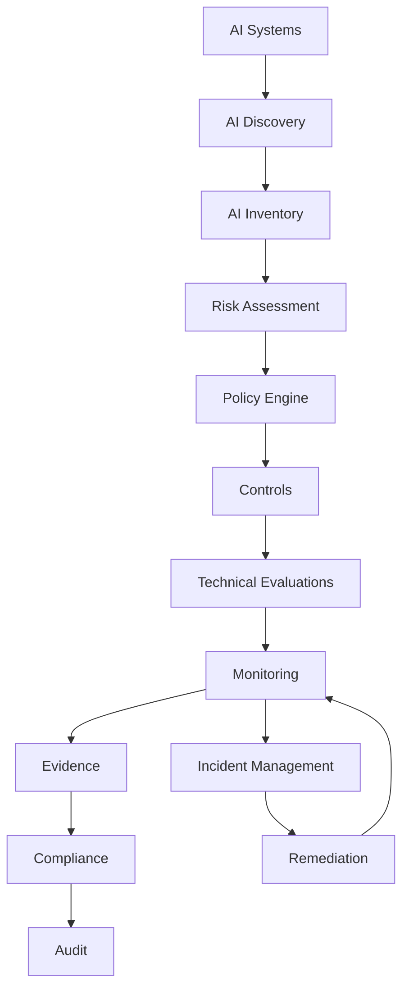
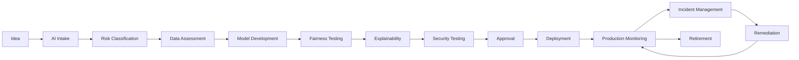

# Awesome-Responsible-AI-Governance

# 🛡️ Top Responsible AI Governance Platforms & Open-Source AI Governance


> A curated list of **Responsible AI Governance, AI GRC, model governance, AI risk management, fairness, explainability, evaluation, monitoring, red-teaming, compliance and AI policy platforms** — with a strong emphasis on open-source alternatives.


Responsible AI Governance is the organizational and technical layer used to ensure that AI systems are:


* **Safe**

* **Fair**

* **Transparent**

* **Explainable**

* **Accountable**

* **Privacy-preserving**

* **Secure**

* **Auditable**

* **Compliant**

* **Human-centered**


The commercial AI governance market includes platforms such as **Credo AI, Holistic AI, Monitaur, Fairly AI / Asenion, Trustible, Saidot, Fiddler AI, Arthur AI, CalypsoAI and ModelOp**.


However, there is currently **no single open-source project that completely reproduces the full functionality of a commercial AI Governance platform**.


Instead, an open-source Responsible AI stack is normally assembled from several layers:


```text

AI Inventory

     +

Risk Assessment

     +

Policy Management

     +

Model Registry

     +

Fairness Testing

     +

Explainability

     +

Security / Red Teaming

     +

Model Monitoring

     +

LLM Evaluation

     +

Guardrails

     +

Lineage

     +

Audit Evidence

     +

Compliance Mapping

     =

Open-Source Responsible AI Governance

```


---


## 📑 Table of Contents


* [☁️ SaaS/Hosted Platforms](#️-saashosted-platforms)

* [🌍 Open-Source](#-open-source)

* [🏛️ Open-Source AI Governance Platforms](#️-open-source-ai-governance-platforms)

* [📋 Open-Source AI Risk & Compliance](#-open-source-ai-risk--compliance)

* [⚖️ Open-Source Fairness & Bias](#️-open-source-fairness--bias)

* [🔍 Open-Source Explainability](#-open-source-explainability)

* [📊 Open-Source Model Monitoring](#-open-source-model-monitoring)

* [🧪 Open-Source AI Evaluation](#-open-source-ai-evaluation)

* [🔴 Open-Source AI Red Teaming](#-open-source-ai-red-teaming)

* [🛡️ Open-Source AI Guardrails](#️-open-source-ai-guardrails)

* [🔐 Open-Source Privacy & PII Protection](#-open-source-privacy--pii-protection)

* [🧬 Open-Source Data & Model Lineage](#-open-source-data--model-lineage)

* [📦 Open-Source Model Governance & Registries](#-open-source-model-governance--registries)

* [📑 Open-Source Documentation & Transparency](#-open-source-documentation--transparency)

* [🤖 Open-Source Agent Governance](#-open-source-agent-governance)

* [🧩 Commercial Platform → Open-Source Equivalent](#-commercial-platform--open-source-equivalent)

* [🏗️ Responsible AI Governance Architecture](#️-responsible-ai-governance-architecture)

* [🔄 Open-Source AI Governance Architecture](#-open-source-ai-governance-architecture)

* [⚖️ Commercial vs Open-Source](#️-commercial-vs-open-source)

* [🚀 Recommended Open-Source Stacks](#-recommended-open-source-stacks)

* [📊 Responsible AI Technology Comparison](#-responsible-ai-technology-comparison)

* [🎯 Recommended Projects by Use Case](#-recommended-projects-by-use-case)

* [🏢 Building a Credo AI Alternative](#-building-a-credo-ai-alternative)

* [🧠 Building an Open-Source AI Governance Platform](#-building-an-open-source-ai-governance-platform)

* [🌐 Open-Source Responsible AI Landscape](#-open-source-responsible-ai-landscape)

* [🧠 Why Open-Source Responsible AI Matters](#-why-open-source-responsible-ai-matters)

* [🤝 Contributing](#-contributing)

* [⚠️ Disclaimer](#️-disclaimer)


---


# ☁️ SaaS/Hosted Platforms


Commercial AI governance platforms provide centralized AI inventories, risk assessments, policy management, compliance workflows, monitoring, audit evidence and lifecycle governance.


| Platform                                                                  | Company                      | Primary Focus                 | Key Capabilities                                                                               |

| ------------------------------------------------------------------------- | ---------------------------- | ----------------------------- | ---------------------------------------------------------------------------------------------- |

| [Credo AI](https://www.credo.ai/)                                         | Credo AI                     | AI Governance                 | AI inventory, risk, policy packs, regulatory mapping, controls, evidence and agent governance  |

| [Holistic AI](https://www.holisticai.com/)                                | Holistic AI                  | AI Governance & Assurance     | AI discovery, risk assessment, bias testing, red teaming, monitoring and policy enforcement    |

| [Monitaur](https://www.monitaur.ai/)                                      | Monitaur                     | Model Governance              | Model governance, model risk, lifecycle management, evidence and regulated-industry governance |

| [Asenion](https://www.asenion.com/)                                       | Asenion / formerly Fairly AI | AI GRC                        | AI governance, risk, compliance and assurance                                                  |

| [Trustible](https://trustible.com/)                                       | Trustible                    | AI GRC                        | AI inventory, risk scoring, vendor assessment, controls and audit evidence                     |

| [Saidot](https://www.saidot.ai/)                                          | Saidot                       | AI Governance                 | Governance knowledge graph, policies, risks, controls, datasets, models and transparency       |

| [Fiddler AI](https://www.fiddler.ai/)                                     | Fiddler AI                   | AI Observability & Governance | Model monitoring, explainability, evaluation, GenAI observability, guardrails and governance   |

| [Arthur AI](https://www.arthur.ai/)                                       | Arthur                       | AI Observability & Governance | Model monitoring, AI evaluations, explainability, policies and agent governance                |

| [CalypsoAI](https://www.calypsoai.com/)                                   | CalypsoAI                    | AI Security & Governance      | AI security, model governance, GenAI security, policy and monitoring                           |

| [ModelOp](https://www.modelop.com/)                                       | ModelOp                      | ModelOps & AI Governance      | AI inventory, lifecycle governance, risk, controls, approvals and enterprise AI oversight      |

| [IBM watsonx.governance](https://www.ibm.com/products/watsonx-governance) | IBM                          | Enterprise AI Governance      | Model governance, AI inventory, risk, compliance, factsheets and lifecycle workflows           |

| [OneTrust AI Governance](https://www.onetrust.com/)                       | OneTrust                     | AI GRC                        | AI inventory, risk, privacy, compliance and governance                                         |

| [ServiceNow AI Control Tower](https://www.servicenow.com/)                | ServiceNow                   | Enterprise AI Governance      | AI inventory, lifecycle, risk, compliance and workflow                                         |

| [SAP LeanIX AI Governance](https://www.sap.com/products/leanix.html)      | SAP                          | AI Governance / EA            | AI inventory, ownership, architecture and governance                                           |

| [LatticeFlow AI](https://latticeflow.ai/)                                 | LatticeFlow                  | AI Quality & Governance       | AI quality, data/model testing, risk and compliance                                            |

| [Modulos](https://www.modulos.ai/)                                        | Modulos                      | AI Governance                 | AI governance, risk, compliance and model lifecycle                                            |

| [Arize AI](https://arize.com/)                                            | Arize                        | AI Observability              | Model monitoring, evaluation, tracing and LLM observability                                    |

| [Aporia](https://www.aporia.com/)                                         | Aporia                       | ML Monitoring                 | Model monitoring, drift, performance, bias and explainability                                  |

| [Superwise](https://www.superwise.ai/)                                    | Superwise                    | Model Governance & Monitoring | Model monitoring, drift, bias and operational risk                                             |


Credo AI currently positions its platform around AI discovery, inventory, risk, policy and evidence across models, applications, agents and vendors.


Holistic AI similarly positions its platform around discovery, testing, continuous monitoring and policy enforcement across AI systems and agents.


---


# 🌍 Open-Source


The open-source Responsible AI ecosystem is much more **modular** than the commercial AI Governance market.


```text

                    RESPONSIBLE AI

                          │

       ┌──────────────────┼──────────────────┐

       │                  │                  │

       ▼                  ▼                  ▼

    Governance          Technical          Runtime

       │                Assurance           Controls

       │                  │                  │

       ▼                  ▼                  ▼

    Inventory          Fairness          Guardrails

    Risk               Explainability    Privacy

    Policies           Evaluation        Security

    Compliance         Monitoring        Policy

    Evidence           Red Teaming       Enforcement

```


The strongest open-source approach is therefore usually to **compose several specialized projects**.


---


# 🏛️ Open-Source AI Governance Platforms


There are relatively few genuinely open-source projects that attempt to provide a complete governance platform.


| Project                                                       | Focus                               | Status         |

| ------------------------------------------------------------- | ----------------------------------- | -------------- |

| [AI Verify](https://github.com/aisingapore/ai-verify)         | AI governance testing and assurance | 🟢 Open Source |

| [AI Verify Project](https://aiverifyfoundation.sg/)           | Responsible AI testing ecosystem    | 🟢 Open Source |

| [Giskard](https://github.com/Giskard-AI/giskard)              | AI quality, testing and risk        | 🟢 Open Source |

| [Evidently](https://github.com/evidentlyai/evidently)         | AI evaluation and monitoring        | 🟢 Open Source |

| [MLflow](https://github.com/mlflow/mlflow)                    | ML lifecycle and model governance   | 🟢 Open Source |

| [Kubeflow](https://github.com/kubeflow/kubeflow)              | ML lifecycle infrastructure         | 🟢 Open Source |

| [NIST Dioptra](https://github.com/usnistgov/dioptra)          | AI testing / risk assessment        | 🟢 Open Source |

| [Inspect AI](https://github.com/UKGovernmentBEIS/inspect_ai)  | AI evaluation                       | 🟢 Open Source |

| [Deepchecks](https://github.com/deepchecks/deepchecks)        | ML validation                       | 🟢 Open Source |

| [AIF360](https://github.com/Trusted-AI/AIF360)                | Fairness and bias                   | 🟢 Open Source |

| [Fairlearn](https://github.com/fairlearn/fairlearn)           | Fairness assessment                 | 🟢 Open Source |

| [Open Policy Agent](https://github.com/open-policy-agent/opa) | Policy-as-code                      | 🟢 Open Source |


> **Important:** these projects do not all attempt to be full AI Governance platforms. Together, however, they provide many of the technical components required to build one.


---


# 📋 Open-Source AI Risk & Compliance


Responsible AI governance requires converting policies and regulations into operational controls.


```text

Regulation

    │

    ▼

Governance Framework

    │

    ▼

Policy

    │

    ▼

Risk

    │

    ▼

Control

    │

    ▼

Technical Test

    │

    ▼

Evidence

    │

    ▼

Audit

```


| Project                                                       | Role                             |

| ------------------------------------------------------------- | -------------------------------- |

| [AI Verify](https://github.com/aisingapore/ai-verify)         | Responsible AI testing framework |

| [NIST Dioptra](https://github.com/usnistgov/dioptra)          | AI risk testing and evaluation   |

| [Open Policy Agent](https://github.com/open-policy-agent/opa) | Policy-as-code                   |

| [Kyverno](https://github.com/kyverno/kyverno)                 | Kubernetes policy engine         |

| [Gatekeeper](https://github.com/open-policy-agent/gatekeeper) | Policy enforcement               |

| [Giskard](https://github.com/Giskard-AI/giskard)              | AI quality and risk testing      |

| [MLflow](https://github.com/mlflow/mlflow)                    | Model lifecycle and governance   |

| [Kubeflow](https://github.com/kubeflow/kubeflow)              | ML lifecycle orchestration       |

| [OpenLineage](https://github.com/OpenLineage/OpenLineage)     | Data / job lineage               |

| [Marquez](https://github.com/MarquezProject/marquez)          | Metadata and lineage             |


---


# ⚖️ Open-Source Fairness & Bias


Fairness is one of the most mature areas of open-source Responsible AI tooling.


```text

Dataset

   │

   ▼

Protected Attributes

   │

   ▼

Model Predictions

   │

   ▼

Fairness Metrics

   │

   ├── Demographic Parity

   ├── Equal Opportunity

   ├── Equalized Odds

   ├── Disparate Impact

   └── Group Performance

   │

   ▼

Mitigation

```


| Project                                                                       | Description                        |

| ----------------------------------------------------------------------------- | ---------------------------------- |

| [Fairlearn](https://github.com/fairlearn/fairlearn)                           | Fairness assessment and mitigation |

| [AI Fairness 360](https://github.com/Trusted-AI/AIF360)                       | Comprehensive fairness toolkit     |

| [Aequitas](https://github.com/dssg/aequitas)                                  | Bias auditing                      |

| [Fairness Indicators](https://github.com/tensorflow/fairness-indicators)      | Fairness evaluation                |

| [What-If Tool](https://github.com/PAIR-code/what-if-tool)                     | Interactive model analysis         |

| [Themis-ML](https://github.com/cosmicBboy/themis-ml)                          | Fairness-aware ML                  |

| [Responsible AI Toolbox](https://github.com/microsoft/responsible-ai-toolbox) | Integrated Responsible AI tooling  |


Fairlearn provides fairness assessment and mitigation methods, while AIF360 provides fairness metrics and bias-mitigation algorithms.


---


# 🔍 Open-Source Explainability


Explainability helps organizations understand **why a model produced a particular output**.


```text

Model

  │

  ▼

Prediction

  │

  ▼

Explanation Engine

  │

  ├── Feature Importance

  ├── Local Explanation

  ├── Global Explanation

  ├── Counterfactuals

  └── Attribution

```


| Project                                                                       | Description                             |

| ----------------------------------------------------------------------------- | --------------------------------------- |

| [SHAP](https://github.com/shap/shap)                                          | Shapley-based explanations              |

| [LIME](https://github.com/marcotcr/lime)                                      | Local interpretable explanations        |

| [InterpretML](https://github.com/interpretml/interpret)                       | Explainable models and interpretability |

| [Captum](https://github.com/pytorch/captum)                                   | PyTorch interpretability                |

| [ELI5](https://github.com/TeamHG-Memex/eli5)                                  | Model inspection and explanation        |

| [Alibi](https://github.com/SeldonIO/alibi)                                    | Explainability and outlier detection    |

| [Responsible AI Toolbox](https://github.com/microsoft/responsible-ai-toolbox) | Integrated explainability               |

| [What-If Tool](https://github.com/PAIR-code/what-if-tool)                     | Interactive analysis                    |


---


# 📊 Open-Source Model Monitoring


Governance cannot stop when a model reaches production.


```text

Development

     │

     ▼

Validation

     │

     ▼

Deployment

     │

     ▼

Production

     │

     ▼

Monitoring

     │

 ┌───┼────────────┐

 ▼   ▼            ▼

Drift Bias      Quality

 │   │            │

 └───┼────────────┘

     ▼

Risk Alert

     │

     ▼

Governance Review

```


| Project                                                  | Description                                 |

| -------------------------------------------------------- | ------------------------------------------- |

| [Evidently](https://github.com/evidentlyai/evidently)    | ML/LLM evaluation and monitoring            |

| [NannyML](https://github.com/NannyML/nannyml)            | Post-deployment performance estimation      |

| [Alibi Detect](https://github.com/SeldonIO/alibi-detect) | Drift, outlier and adversarial detection    |

| [whylogs](https://github.com/whylabs/whylogs)            | Statistical data profiling                  |

| [Deepchecks](https://github.com/deepchecks/deepchecks)   | Data and model validation                   |

| [MLflow](https://github.com/mlflow/mlflow)               | Model lifecycle and monitoring integrations |

| [Prometheus](https://github.com/prometheus/prometheus)   | Metrics infrastructure                      |

| [Grafana](https://github.com/grafana/grafana)            | Monitoring dashboards                       |


Evidently describes itself as an open-source framework for evaluating, testing and monitoring ML and LLM systems, including offline evaluation and live monitoring.


---


# 🧪 Open-Source AI Evaluation


Evaluation is increasingly becoming one of the most important technical components of AI governance.


| Project                                                                      | Focus                         |

| ---------------------------------------------------------------------------- | ----------------------------- |

| [Inspect AI](https://github.com/UKGovernmentBEIS/inspect_ai)                 | LLM evaluation                |

| [DeepEval](https://github.com/confident-ai/deepeval)                         | LLM evaluation                |

| [Giskard](https://github.com/Giskard-AI/giskard)                             | AI testing                    |

| [Ragas](https://github.com/explodinggradients/ragas)                         | RAG evaluation                |

| [promptfoo](https://github.com/promptfoo/promptfoo)                          | LLM evaluation and testing    |

| [Evidently](https://github.com/evidentlyai/evidently)                        | LLM evaluation and monitoring |

| [OpenAI Evals](https://github.com/openai/evals)                              | Model evaluation framework    |

| [DeepTeam](https://github.com/confident-ai/deepteam)                         | LLM red teaming               |

| [NIST Dioptra](https://github.com/usnistgov/dioptra)                         | AI testing                    |

| [lm-evaluation-harness](https://github.com/EleutherAI/lm-evaluation-harness) | LLM benchmarking              |


---


# 🔴 Open-Source AI Red Teaming


Responsible AI governance increasingly requires adversarial testing.


```text

                  AI SYSTEM

                      │

          ┌───────────┼───────────┐

          ▼           ▼           ▼

       Jailbreak    Prompt      Data

        Tests       Injection   Leakage

          │           │           │

          └───────────┼───────────┘

                      ▼

                 Red Teaming

                      │

                      ▼

                Risk Findings

                      │

                      ▼

                 Remediation

```


| Project                                                                                        | Description                        |

| ---------------------------------------------------------------------------------------------- | ---------------------------------- |

| [PyRIT](https://github.com/Azure/PyRIT)                                                        | Generative AI red teaming          |

| [Garak](https://github.com/NVIDIA/garak)                                                       | LLM vulnerability scanning         |

| [promptfoo](https://github.com/promptfoo/promptfoo)                                            | LLM testing and red teaming        |

| [DeepTeam](https://github.com/confident-ai/deepteam)                                           | LLM red teaming                    |

| [Inspect AI](https://github.com/UKGovernmentBEIS/inspect_ai)                                   | AI evaluation and security testing |

| [NVIDIA NeMo Guardrails](https://github.com/NVIDIA-NeMo/NeMo-Guardrails)                       | Programmable LLM controls          |

| [Adversarial Robustness Toolbox](https://github.com/Trusted-AI/adversarial-robustness-toolbox) | Adversarial ML                     |

| [TextAttack](https://github.com/QData/TextAttack)                                              | NLP adversarial attacks            |

| [Counterfit](https://github.com/Azure/counterfit)                                              | AI security testing                |


---


# 🛡️ Open-Source AI Guardrails


Governance becomes substantially more powerful when policies can be enforced at runtime.


```text

User

 │

 ▼

AI Gateway

 │

 ▼

Policy Engine

 │

 ├── Content Policy

 ├── PII Policy

 ├── Safety Policy

 ├── Access Policy

 ├── Tool Policy

 └── Compliance Policy

 │

 ▼

Model / Agent

 │

 ▼

Output Guardrail

 │

 ▼

User

```


| Project                                                                 | Description                          |

| ----------------------------------------------------------------------- | ------------------------------------ |

| [NeMo Guardrails](https://github.com/NVIDIA-NeMo/NeMo-Guardrails)       | Programmable LLM guardrails          |

| [Guardrails AI](https://github.com/guardrails-ai/guardrails)            | LLM output validation and guardrails |

| [Open Policy Agent](https://github.com/open-policy-agent/opa)           | General policy engine                |

| [LiteLLM](https://github.com/BerriAI/litellm)                           | LLM gateway and policy integrations  |

| [LLM Guard](https://github.com/protectai/llm-guard)                     | Security and privacy scanners        |

| [Llama Guard](https://github.com/meta-llama/PurpleLlama)                | LLM safety classification            |

| [Presidio](https://github.com/microsoft/presidio)                       | PII detection and anonymization      |

| [NVIDIA NIM Guardrails](https://github.com/NVIDIA-NeMo/NeMo-Guardrails) | NVIDIA guardrail ecosystem           |


---


# 🔐 Open-Source Privacy & PII Protection


Responsible AI programs need controls over sensitive information.


| Project                                                       | Description                     |

| ------------------------------------------------------------- | ------------------------------- |

| [Microsoft Presidio](https://github.com/microsoft/presidio)   | PII detection and anonymization |

| [OpenDP](https://github.com/opendp/opendp)                    | Differential privacy            |

| [ARX](https://github.com/arx-deidentifier/arx)                | Data anonymization              |

| [synthcity](https://github.com/vanderschaarlab/synthcity)     | Synthetic data                  |

| [SDV](https://github.com/sdv-dev/SDV)                         | Synthetic data generation       |

| [Opacus](https://github.com/pytorch/opacus)                   | Differentially private ML       |

| [Open Policy Agent](https://github.com/open-policy-agent/opa) | Policy enforcement              |


---


# 🧬 Open-Source Data & Model Lineage


Governance requires knowing:


```text

Where did this model come from?

             │

             ▼

What data trained it?

             │

             ▼

Which version was deployed?

             │

             ▼

Which application uses it?

             │

             ▼

Who approved it?

             │

             ▼

What happened in production?

```


| Project                                                       | Role                         |

| ------------------------------------------------------------- | ---------------------------- |

| [OpenLineage](https://github.com/OpenLineage/OpenLineage)     | Open lineage standard        |

| [Marquez](https://github.com/MarquezProject/marquez)          | Metadata / lineage service   |

| [MLflow](https://github.com/mlflow/mlflow)                    | Experiment and model lineage |

| [DVC](https://github.com/iterative/dvc)                       | Data and model versioning    |

| [LakeFS](https://github.com/treeverse/lakeFS)                 | Data versioning              |

| [DataHub](https://github.com/datahub-project/datahub)         | Data catalog and lineage     |

| [OpenMetadata](https://github.com/open-metadata/OpenMetadata) | Metadata and governance      |

| [Amundsen](https://github.com/amundsen-io/amundsen)           | Data discovery and metadata  |


---


# 📦 Open-Source Model Governance & Registries


A governance platform needs a central inventory of models and AI systems.


| Project                                                   | Description                  |

| --------------------------------------------------------- | ---------------------------- |

| [MLflow Model Registry](https://github.com/mlflow/mlflow) | Model registry and lifecycle |

| [Kubeflow](https://github.com/kubeflow/kubeflow)          | ML lifecycle                 |

| [KServe](https://github.com/kserve/kserve)                | Model serving                |

| [BentoML](https://github.com/bentoml/BentoML)             | Model serving                |

| [Seldon Core](https://github.com/SeldonIO/seldon-core)    | ML deployment / monitoring   |

| [Feast](https://github.com/feast-dev/feast)               | Feature store                |

| [ModelDB](https://github.com/VertaAI/modeldb)             | Model metadata               |

| [ClearML](https://github.com/clearml/clearml)             | ML lifecycle management      |


---


# 📑 Open-Source Documentation & Transparency


Responsible AI governance needs standardized documentation.


| Project / Standard                                                           | Purpose                           |

| ---------------------------------------------------------------------------- | --------------------------------- |

| [Model Cards Toolkit](https://github.com/tensorflow/model-card-toolkit)      | Model documentation               |

| [Datasheets for Datasets](https://arxiv.org/abs/1803.09010)                  | Dataset documentation methodology |

| [Data Cards](https://github.com/IBM/data-prep-kit)                           | Dataset transparency              |

| [MLflow](https://github.com/mlflow/mlflow)                                   | Experiment/model metadata         |

| [Hugging Face Model Cards](https://huggingface.co/docs/hub/model-cards)      | Model transparency                |

| [Hugging Face Dataset Cards](https://huggingface.co/docs/hub/datasets-cards) | Dataset transparency              |


---


# 🤖 Open-Source Agent Governance


Agentic AI introduces a new governance problem because agents can **take actions**, rather than merely generate outputs.


```text

                    AI AGENT

                       │

              ┌────────┼────────┐

              ▼        ▼        ▼

            Tools     APIs    Databases

              │        │        │

              └────────┼────────┘

                       ▼

                 External Action

```


Governance therefore needs:


* Agent inventory

* Identity

* Tool permissions

* Data permissions

* Action policies

* Human approval

* Audit logs

* Rate limits

* Kill switches

* Runtime monitoring


| Project                                                           | Useful Capability        |

| ----------------------------------------------------------------- | ------------------------ |

| [Open Policy Agent](https://github.com/open-policy-agent/opa)     | Policy enforcement       |

| [NeMo Guardrails](https://github.com/NVIDIA-NeMo/NeMo-Guardrails) | LLM/agent guardrails     |

| [Guardrails AI](https://github.com/guardrails-ai/guardrails)      | Output validation        |

| [LangGraph](https://github.com/langchain-ai/langgraph)            | Stateful agent workflows |

| [AutoGen](https://github.com/microsoft/autogen)                   | Multi-agent systems      |

| [CrewAI](https://github.com/crewAIInc/crewAI)                     | Agent orchestration      |

| [Inspect AI](https://github.com/UKGovernmentBEIS/inspect_ai)      | Agent evaluation         |

| [PyRIT](https://github.com/Azure/PyRIT)                           | Agent/LLM red teaming    |


---


# 🧩 Commercial Platform → Open-Source Equivalent


| Commercial Platform             | Open-Source Equivalent / Building Blocks                                   |

| ------------------------------- | -------------------------------------------------------------------------- |

| **Credo AI**                    | MLflow + Open Policy Agent + Fairlearn + Evidently + Giskard + OpenLineage |

| **Holistic AI**                 | AI Verify + Fairlearn + Giskard + PyRIT + Evidently                        |

| **Monitaur**                    | MLflow + OpenLineage + Model Cards + OPA + Evidently                       |

| **Fairly AI / Asenion**         | AI Verify + Fairlearn + AIF360 + Giskard + OPA                             |

| **Trustible**                   | MLflow + OpenMetadata + OPA + OpenLineage + AI Verify                      |

| **Saidot**                      | OpenMetadata + MLflow + OPA + Model Cards + compliance knowledge base      |

| **Fiddler AI**                  | Evidently + SHAP + Alibi Detect + Prometheus + Grafana                     |

| **Arthur AI**                   | Evidently + Alibi Detect + SHAP + OpenTelemetry + OPA                      |

| **CalypsoAI**                   | NeMo Guardrails + LLM Guard + Presidio + PyRIT + OPA                       |

| **ModelOp**                     | MLflow + Kubeflow + OpenLineage + OPA + Evidently                          |

| **IBM watsonx.governance**      | MLflow + Kubeflow + OpenLineage + Fairlearn + OPA                          |

| **OneTrust AI Governance**      | OpenMetadata + OPA + AI Verify + Presidio + OpenLineage                    |

| **ServiceNow AI Control Tower** | OpenMetadata + MLflow + OpenLineage + OPA                                  |

| **Enterprise AI GRC**           | OpenMetadata + MLflow + AI Verify + OPA + Evidence Store                   |

| **AI Model Governance**         | MLflow + Model Cards + OpenLineage + Evidently                             |

| **AI Fairness Platform**        | Fairlearn + AIF360 + Aequitas + Responsible AI Toolbox                     |

| **AI Observability Platform**   | Evidently + OpenTelemetry + Prometheus + Grafana                           |

| **AI Security Governance**      | PyRIT + Garak + LLM Guard + Presidio + OPA                                 |

| **LLM Governance**              | Inspect AI + DeepEval + promptfoo + NeMo Guardrails + Evidently            |

| **Agent Governance**            | OPA + NeMo Guardrails + OpenTelemetry + Inspect AI                         |

| **AI Compliance Platform**      | AI Verify + OPA + MLflow + OpenLineage + Model Cards                       |


---


# 🏗️ Responsible AI Governance Architecture


A commercial governance platform can conceptually be decomposed into:





---


# 🔄 Open-Source AI Governance Architecture


A practical open-source architecture can be assembled as:


```text

                         AI SYSTEMS

                             │

              ┌──────────────┼──────────────┐

              ▼              ▼              ▼

            Models         Agents         Vendors

              │              │              │

              └──────────────┼──────────────┘

                             ▼

                       AI INVENTORY

                             │

                         MLflow / DB

                             │

                             ▼

                       RISK ENGINE

                             │

                ┌────────────┼────────────┐

                ▼            ▼            ▼

            Fairness    Security      Privacy

                │            │            │

            Fairlearn      PyRIT       Presidio

            AIF360         Garak       OpenDP

                │            │            │

                └────────────┼────────────┘

                             ▼

                       POLICY ENGINE

                             │

                       Open Policy Agent

                             │

                             ▼

                         EVIDENCE

                             │

              ┌──────────────┼──────────────┐

              ▼              ▼              ▼

          OpenLineage      MLflow       Evidently

              │              │              │

              └──────────────┼──────────────┘

                             ▼

                        AUDIT / GRC

```


---


# 🧪 Responsible AI Lifecycle





---


# 📋 AI Governance Control Matrix


An open-source governance system can map requirements to technical evidence.


| Governance Domain | Example Control             | Open-Source Implementation  |

| ----------------- | --------------------------- | --------------------------- |

| AI Inventory      | Maintain AI system registry | MLflow + OpenMetadata       |

| Ownership         | Assign system owner         | PostgreSQL / OpenMetadata   |

| Risk              | Risk classification         | Custom policy engine        |

| Fairness          | Test protected groups       | Fairlearn / AIF360          |

| Explainability    | Explain decisions           | SHAP / LIME                 |

| Privacy           | Detect PII                  | Presidio                    |

| Security          | Red-team AI                 | PyRIT / Garak               |

| LLM Safety        | Test harmful outputs        | NeMo Guardrails             |

| Drift             | Detect distribution changes | Evidently / Alibi Detect    |

| Data Lineage      | Track datasets              | OpenLineage                 |

| Model Lineage     | Track model versions        | MLflow                      |

| Documentation     | Model cards                 | Model Card Toolkit          |

| Policy            | Machine-readable policies   | OPA                         |

| Audit             | Evidence collection         | OpenTelemetry + database    |

| Monitoring        | Production telemetry        | Prometheus + Grafana        |

| Incident          | Track violations            | Git / database / workflow   |

| Approval          | Human sign-off              | Workflow engine             |

| Compliance        | Framework mapping           | AI Verify + custom mappings |


---


# ⚖️ Commercial vs Open-Source


| Capability              | Commercial AI Governance | Open-Source Stack    |

| ----------------------- | ------------------------ | -------------------- |

| AI Inventory            | ✅                        | ✅                    |

| Model Registry          | ✅                        | ✅                    |

| Risk Assessment         | ✅                        | ✅                    |

| Policy Management       | ✅                        | ✅                    |

| Compliance Mapping      | ✅                        | ⚠️ Build / integrate |

| Audit Evidence          | ✅                        | ✅                    |

| Fairness Testing        | ✅                        | ✅                    |

| Explainability          | ✅                        | ✅                    |

| Drift Monitoring        | ✅                        | ✅                    |

| LLM Evaluation          | ✅                        | ✅                    |

| Red Teaming             | ✅                        | ✅                    |

| Guardrails              | ✅                        | ✅                    |

| Privacy                 | ✅                        | ✅                    |

| Lineage                 | ✅                        | ✅                    |

| Vendor Risk             | ✅                        | ⚠️ Build / integrate |

| AI Procurement          | ✅                        | ⚠️                   |

| Regulatory Intelligence | ✅                        | ⚠️ Build / integrate |

| Workflow                | ✅                        | Build / integrate    |

| Dashboards              | ✅                        | Build / integrate    |

| Self Hosting            | Sometimes                | ✅                    |

| Air-Gapped              | Varies                   | ✅                    |

| Source Code             | ❌                        | ✅                    |

| Customization           | Medium                   | Very High            |

| Vendor Lock-In          | Higher                   | Lower                |

| Implementation Effort   | Lower                    | Higher               |

| Compliance Expertise    | Often included           | Must provide         |

| Infrastructure          | Managed                  | Self-managed         |


---


# 📊 Responsible AI Technology Comparison


| Project             | Governance | Fairness | Explainability | Monitoring | Evaluation | Security | Policy |

| ------------------- | :--------: | :------: | :------------: | :--------: | :--------: | :------: | :----: |

| AI Verify           |      ✅     |     ✅    |       ⚠️       |     ⚠️     |      ✅     |    ⚠️    |   ⚠️   |

| Fairlearn           |      ❌     |     ✅    |        ❌       |      ❌     |     ⚠️     |     ❌    |    ❌   |

| AIF360              |      ❌     |     ✅    |        ❌       |      ❌     |     ⚠️     |     ❌    |    ❌   |

| SHAP                |      ❌     |     ❌    |        ✅       |      ❌     |      ❌     |     ❌    |    ❌   |

| Evidently           |     ⚠️     |    ⚠️    |        ❌       |      ✅     |      ✅     |     ❌    |    ❌   |

| Giskard             |     ⚠️     |     ✅    |       ⚠️       |     ⚠️     |      ✅     |     ✅    |    ❌   |

| MLflow              |      ✅     |     ❌    |        ❌       |     ⚠️     |     ⚠️     |     ❌    |   ⚠️   |

| OpenLineage         |     ⚠️     |     ❌    |        ❌       |      ❌     |      ❌     |     ❌    |    ❌   |

| PyRIT               |      ❌     |     ❌    |        ❌       |      ❌     |      ✅     |     ✅    |    ❌   |

| Garak               |      ❌     |     ❌    |        ❌       |      ❌     |      ✅     |     ✅    |    ❌   |

| NeMo Guardrails     |     ⚠️     |    ⚠️    |        ❌       |     ⚠️     |      ✅     |     ✅    |    ✅   |

| OPA                 |     ⚠️     |     ❌    |        ❌       |      ❌     |      ❌     |    ⚠️    |    ✅   |

| Presidio            |      ❌     |     ❌    |        ❌       |      ❌     |      ❌     |     ✅    |   ⚠️   |

| Inspect AI          |     ⚠️     |    ⚠️    |        ❌       |      ❌     |      ✅     |     ✅    |    ❌   |

| Model Cards Toolkit |     ⚠️     |    ⚠️    |       ⚠️       |      ❌     |      ❌     |     ❌    |    ❌   |


---


# 🎯 Recommended Projects by Use Case


| Use Case                       | Recommended Starting Point                                         |

| ------------------------------ | ------------------------------------------------------------------ |

| General Responsible AI         | **AI Verify**                                                      |

| AI governance testing          | **AI Verify**                                                      |

| AI fairness                    | **Fairlearn**                                                      |

| Comprehensive fairness toolkit | **AIF360**                                                         |

| Bias auditing                  | **Aequitas**                                                       |

| Explainability                 | **SHAP**                                                           |

| Model interpretability         | **InterpretML**                                                    |

| Production monitoring          | **Evidently**                                                      |

| Data drift                     | **Evidently / Alibi Detect**                                       |

| AI quality testing             | **Giskard**                                                        |

| LLM evaluation                 | **Inspect AI / DeepEval**                                          |

| RAG evaluation                 | **Ragas**                                                          |

| LLM red teaming                | **PyRIT / Garak**                                                  |

| LLM security                   | **Garak / LLM Guard**                                              |

| Prompt testing                 | **promptfoo**                                                      |

| LLM guardrails                 | **NeMo Guardrails**                                                |

| Output validation              | **Guardrails AI**                                                  |

| PII protection                 | **Presidio**                                                       |

| Differential privacy           | **OpenDP / Opacus**                                                |

| Model registry                 | **MLflow**                                                         |

| ML lifecycle                   | **Kubeflow**                                                       |

| Data lineage                   | **OpenLineage**                                                    |

| Data governance                | **OpenMetadata / DataHub**                                         |

| Policy-as-code                 | **Open Policy Agent**                                              |

| Kubernetes policy              | **Kyverno / Gatekeeper**                                           |

| Model documentation            | **Model Card Toolkit**                                             |

| Agent evaluation               | **Inspect AI**                                                     |

| Agent policy enforcement       | **OPA + Guardrails**                                               |

| Full OSS governance stack      | **MLflow + AI Verify + Fairlearn + Evidently + OPA + OpenLineage** |


---


# 🏢 Building a Credo AI Alternative


A Credo AI-like platform can be decomposed into several open-source layers.


```text

                         ENTERPRISE

                             │

                             ▼

                       AI DISCOVERY

                             │

                             ▼

                       AI INVENTORY

                             │

                             ▼

                       RISK ENGINE

                             │

            ┌────────────────┼────────────────┐

            ▼                ▼                ▼

         Models           Agents           Vendors

            │                │                │

            └────────────────┼────────────────┘

                             ▼

                       POLICY ENGINE

                             │

                             ▼

                    TECHNICAL CONTROLS

                             │

          ┌──────────────────┼──────────────────┐

          ▼                  ▼                  ▼

      Fairness          Security            Privacy

      Fairlearn         PyRIT               Presidio

      AIF360            Garak               OpenDP

          │                  │                  │

          └──────────────────┼──────────────────┘

                             ▼

                         EVIDENCE

                             │

          ┌──────────────────┼──────────────────┐

          ▼                  ▼                  ▼

       MLflow           OpenLineage         Evidently

          │                  │                  │

          └──────────────────┼──────────────────┘

                             ▼

                       GOVERNANCE DB

                             │

                             ▼

                      AUDIT DASHBOARD

```


### Suggested Technology Stack


```text

Frontend

    → React / Next.js


API

    → FastAPI


Database

    → PostgreSQL


AI Registry

    → MLflow + PostgreSQL


Data Catalog

    → OpenMetadata


Lineage

    → OpenLineage


Policy Engine

    → Open Policy Agent


Fairness

    → Fairlearn + AIF360


Explainability

    → SHAP + InterpretML


Monitoring

    → Evidently


Security Testing

    → PyRIT + Garak


LLM Evaluation

    → Inspect AI + DeepEval


Privacy

    → Presidio


Evidence

    → PostgreSQL + Object Storage


Authentication

    → Keycloak


Observability

    → OpenTelemetry + Prometheus + Grafana

```


---


# 🧠 Building an Open-Source AI Governance Platform


A full open-source governance platform can be organized around an **AI Governance Knowledge Graph**.


```text

                         AI GOVERNANCE GRAPH


                              AI SYSTEM

                                  │

            ┌─────────────────────┼─────────────────────┐

            │                     │                     │

            ▼                     ▼                     ▼

          MODEL                DATASET                AGENT

            │                     │                     │

            ▼                     ▼                     ▼

          RISK                 PURPOSE                TOOLS

            │                     │                     │

            ▼                     ▼                     ▼

         CONTROL               POLICY                 ACTION

            │                     │                     │

            └─────────────────────┼─────────────────────┘

                                  ▼

                               EVIDENCE

                                  │

                                  ▼

                              ASSESSMENT

                                  │

                                  ▼

                              DECISION

                                  │

                                  ▼

                               AUDIT

```


This architecture resembles the conceptual direction taken by modern governance platforms: systems, models, agents, datasets, risks, controls, policies and evidence need to be connected rather than stored as isolated checklists. Saidot, for example, describes a governance model spanning systems, risks, controls, policies, models, datasets and agents.


---


# 🔄 Continuous AI Governance


Traditional governance:


```text

Annual Assessment

       │

       ▼

Approval

       │

       ▼

Deployment

       │

       ▼

Next Annual Review

```


Modern AI governance:


```text

                 ┌─────────────────────┐

                 │    AI System        │

                 └──────────┬──────────┘

                            ▼

                        Discovery

                            │

                            ▼

                         Risk

                            │

                            ▼

                        Controls

                            │

                            ▼

                        Testing

                            │

                            ▼

                        Approval

                            │

                            ▼

                       Deployment

                            │

                            ▼

                       Monitoring

                            │

                            ▼

                         Alerts

                            │

                            ▼

                       Reassessment

                            │

                            └──────────────┐

                                           │

                                           ▼

                                      Continuous Loop

```


This shift from point-in-time compliance toward continuous governance is increasingly important as organizations deploy AI systems and autonomous agents at much greater scale.


---


# 🛡️ AI Governance Control Plane


A useful way to think about Responsible AI Governance is as a **control plane sitting above the AI stack**.


```text

┌─────────────────────────────────────────────────────┐

│              AI GOVERNANCE CONTROL PLANE             │

│                                                     │

│  Inventory • Risk • Policy • Compliance • Evidence │

│  Approvals • Ownership • Controls • Audit          │

└────────────────────────┬────────────────────────────┘

                         │

        ┌────────────────┼─────────────────┐

        ▼                ▼                 ▼

   ML Models          LLM Apps           Agents

        │                │                 │

        ▼                ▼                 ▼

   ML Pipelines       RAG Systems       Tool Calls

        │                │                 │

        └────────────────┼─────────────────┘

                         ▼

                    Production

```


---


# 🔐 AI Governance + AI Security


Responsible AI Governance should not be treated as completely separate from AI security.


```text

                    AI GOVERNANCE

                          │

          ┌───────────────┼───────────────┐

          ▼               ▼               ▼

       Safety          Security         Privacy

          │               │               │

          ▼               ▼               ▼

      Bias Tests      Red Teaming       PII

      Toxicity        Prompt Injection  Leakage

      Hallucination   Jailbreaks        Data Use

          │               │               │

          └───────────────┼───────────────┘

                          ▼

                       Evidence

                          │

                          ▼

                         Audit

```


Useful open-source components:


```text

Safety

→ NeMo Guardrails


Security

→ PyRIT + Garak


Privacy

→ Presidio + OpenDP


Fairness

→ Fairlearn + AIF360


Monitoring

→ Evidently


Policy

→ OPA


Evidence

→ OpenTelemetry + OpenLineage

```


---


# 🌐 Open-Source Responsible AI Landscape


```mermaid

mindmap

  root((Responsible AI))

    Governance

      AI Verify

      Giskard

      MLflow

      NIST Dioptra

    Risk

      AI Verify

      Giskard

      NIST Dioptra

      OPA

    Fairness

      Fairlearn

      AIF360

      Aequitas

      Fairness Indicators

    Explainability

      SHAP

      LIME

      InterpretML

      Captum

      Alibi

    Monitoring

      Evidently

      NannyML

      Alibi Detect

      whylogs

      Deepchecks

    Evaluation

      Inspect AI

      DeepEval

      Ragas

      promptfoo

      lm-evaluation-harness

    Security

      PyRIT

      Garak

      ART

      TextAttack

    Guardrails

      NeMo Guardrails

      Guardrails AI

      LLM Guard

      OPA

    Privacy

      Presidio

      OpenDP

      Opacus

      ARX

      SDV

    Lineage

      OpenLineage

      Marquez

      MLflow

      DataHub

      OpenMetadata

    Documentation

      Model Cards Toolkit

      Dataset Cards

      Datasheets

    ModelOps

      MLflow

      Kubeflow

      KServe

      Seldon Core

    Agents

      Inspect AI

      OPA

      NeMo Guardrails

      PyRIT

```


---


# 🧱 The Open-Source Responsible AI Stack


A complete open-source stack can be assembled as:


```text

┌──────────────────────────────────────────────────┐

│                 GOVERNANCE UI                    │

│             React / Next.js                      │

├──────────────────────────────────────────────────┤

│              GOVERNANCE API                      │

│                 FastAPI                           │

├──────────────────────────────────────────────────┤

│              AI INVENTORY                        │

│          MLflow / OpenMetadata                   │

├──────────────────────────────────────────────────┤

│               RISK ENGINE                        │

│          Custom Rules + OPA                      │

├──────────────────────────────────────────────────┤

│          RESPONSIBLE AI TESTING                  │

│ Fairlearn • AIF360 • SHAP • Giskard              │

├──────────────────────────────────────────────────┤

│             LLM EVALUATION                      │

│ Inspect • DeepEval • Ragas • promptfoo            │

├──────────────────────────────────────────────────┤

│              SECURITY                            │

│       PyRIT • Garak • ART                        │

├──────────────────────────────────────────────────┤

│              GUARDRAILS                          │

│ NeMo Guardrails • Guardrails AI • LLM Guard      │

├──────────────────────────────────────────────────┤

│               PRIVACY                            │

│       Presidio • OpenDP • Opacus                 │

├──────────────────────────────────────────────────┤

│              MONITORING                          │

│     Evidently • Prometheus • Grafana              │

├──────────────────────────────────────────────────┤

│               LINEAGE                            │

│     OpenLineage • DataHub • OpenMetadata          │

├──────────────────────────────────────────────────┤

│                DATA                              │

│             PostgreSQL                            │

└──────────────────────────────────────────────────┘

```


---


# 🚀 Recommended Open-Source Stacks


## 🏆 1. General Enterprise Responsible AI


```text

MLflow

+

AI Verify

+

Fairlearn

+

Evidently

+

Open Policy Agent

+

OpenLineage

+

PostgreSQL

```


Best starting point for organizations that need a broad governance foundation.


---


## ⚖️ 2. Fairness-First AI Governance


```text

Fairlearn

+

AIF360

+

Aequitas

+

SHAP

+

MLflow

+

Evidently

```


Best for:


* Hiring

* Lending

* Insurance

* Healthcare

* Risk scoring

* High-impact automated decisions


---


## 🤖 3. GenAI Governance


```text

MLflow

+

Inspect AI

+

DeepEval

+

promptfoo

+

NeMo Guardrails

+

Garak

+

Presidio

+

Evidently

```


Best for:


* Enterprise LLMs

* RAG

* Chatbots

* AI assistants

* GenAI applications


---


## 🔴 4. AI Security + Governance


```text

PyRIT

+

Garak

+

LLM Guard

+

Presidio

+

OPA

+

NeMo Guardrails

+

OpenTelemetry

```


Best for organizations where Responsible AI overlaps heavily with AI security.


---


## 🏢 5. Enterprise Model Governance


```text

MLflow

+

Kubeflow

+

OpenLineage

+

Evidently

+

SHAP

+

Fairlearn

+

OPA

```


Best for:


* Banks

* Insurance

* Healthcare

* Large ML teams

* Model-risk management


---


## 🌐 6. Full Open-Source AI Governance Platform


```text

                Governance UI

                     │

                  FastAPI

                     │

             ┌───────┴────────┐

             ▼                ▼

        AI Inventory       Risk Engine

         MLflow            OPA

             │                │

             └───────┬────────┘

                     ▼

               AI Assessments

                     │

      ┌──────────────┼──────────────┐

      ▼              ▼              ▼

   Fairness      Explainability   Security

  Fairlearn         SHAP          PyRIT

  AIF360          LIME            Garak

      │              │              │

      └──────────────┼──────────────┘

                     ▼

                  Evidence

                     │

          ┌──────────┼──────────┐

          ▼          ▼          ▼

      Evidently   OpenLineage  MLflow

          │          │          │

          └──────────┼──────────┘

                     ▼

                 Audit DB

```


---


# 📊 Commercial Governance → OSS Architecture


```text

Credo AI

    │

    ├── AI Registry       → MLflow / OpenMetadata

    ├── Risk              → OPA + custom risk engine

    ├── Policy            → OPA

    ├── Controls          → Fairlearn / Giskard / PyRIT

    ├── Monitoring        → Evidently

    ├── Evidence         → OpenTelemetry

    └── Lineage          → OpenLineage


Holistic AI

    │

    ├── AI Discovery      → OpenMetadata

    ├── Bias Testing      → Fairlearn / AIF360

    ├── Red Teaming       → PyRIT / Garak

    ├── Monitoring        → Evidently

    ├── Guardrails        → NeMo Guardrails

    └── Policy            → OPA


Fiddler / Arthur

    │

    ├── Monitoring        → Evidently

    ├── Drift             → Evidently / Alibi Detect

    ├── Explainability    → SHAP

    ├── Evaluation        → DeepEval / Inspect

    └── Telemetry         → OpenTelemetry


ModelOp / Monitaur

    │

    ├── Model Registry    → MLflow

    ├── Lifecycle         → Kubeflow

    ├── Lineage           → OpenLineage

    ├── Monitoring        → Evidently

    ├── Risk              → OPA

    └── Documentation     → Model Cards

```


---


# 🧠 Why Open-Source Responsible AI Matters


Responsible AI governance is ultimately about **trust and evidence**.


Organizations should be able to answer:


```text

What AI systems do we operate?

             │

             ▼

Who owns them?

             │

             ▼

What data do they use?

             │

             ▼

What risks do they create?

             │

             ▼

What controls mitigate those risks?

             │

             ▼

Were those controls actually tested?

             │

             ▼

What happened in production?

             │

             ▼

Can we prove it to an auditor?

```


Open-source software provides several important advantages:


* **Transparency**

* **Inspectability**

* **Self-hosting**

* **Air-gapped deployment**

* **Data sovereignty**

* **Custom policies**

* **Custom evaluation**

* **Vendor independence**

* **Reproducibility**

* **Research flexibility**

* **Integration freedom**


But open-source tooling does **not automatically create Responsible AI**.


The organization still needs:


* Governance policies

* Clearly defined ownership

* Human oversight

* Risk appetite

* Regulatory interpretation

* Model validation

* Documentation

* Incident processes

* Accountability

* Appropriate legal and compliance expertise


---


# 🔥 The Most Important Open-Source Projects


If you want to build an open-source alternative to the **Responsible AI Governance** category, the most important projects to evaluate first are:


```text

                    TOP OSS BUILDING BLOCKS


                         AI Verify

                            │

                            ▼

                         MLflow

                            │

             ┌──────────────┼──────────────┐

             ▼              ▼              ▼

         Fairlearn        SHAP          Evidently

             │              │              │

             ▼              ▼              ▼

          AIF360        InterpretML    Alibi Detect

             │              │              │

             └──────────────┼──────────────┘

                            ▼

                           OPA

                            │

              ┌─────────────┼─────────────┐

              ▼             ▼             ▼

            PyRIT         Garak       Presidio

              │             │             │

              └─────────────┼─────────────┘

                            ▼

                    NeMo Guardrails

                            │

                            ▼

                       OpenLineage

                            │

                            ▼

                      Audit Evidence

```


---


# 🏆 Recommended OSS Core


If only a handful of projects are selected, a particularly strong starting combination is:


| Layer              | Project               |

| ------------------ | --------------------- |

| AI Registry        | **MLflow**            |

| Governance Testing | **AI Verify**         |

| Fairness           | **Fairlearn**         |

| Bias Mitigation    | **AIF360**            |

| Explainability     | **SHAP**              |

| Monitoring         | **Evidently**         |

| AI Testing         | **Giskard**           |

| LLM Evaluation     | **Inspect AI**        |

| Red Teaming        | **PyRIT**             |

| LLM Security       | **Garak**             |

| Guardrails         | **NeMo Guardrails**   |

| Privacy            | **Presidio**          |

| Policy             | **Open Policy Agent** |

| Lineage            | **OpenLineage**       |

| Metadata           | **OpenMetadata**      |

| Observability      | **OpenTelemetry**     |

| Dashboards         | **Grafana**           |


---


# 🤝 Contributing


Contributions are welcome!


Please consider adding:


* AI governance platforms

* Responsible AI frameworks

* AI GRC software

* Model governance systems

* Model registries

* AI risk assessment tools

* Fairness libraries

* Bias auditing tools

* Explainability frameworks

* Model monitoring systems

* LLM evaluation frameworks

* AI red-teaming tools

* AI security tools

* LLM guardrails

* Privacy-preserving AI

* Differential privacy

* Data lineage

* Model lineage

* AI documentation frameworks

* Model cards

* Dataset cards

* Policy-as-code frameworks

* Agent governance tools

* AI compliance tools

* Audit frameworks

* Open-source AI standards


When adding a project, please distinguish between:


* **Fully open-source**

* **Open-core**

* **Source available**

* **Commercial platform with an OSS component**

* **Open-source library**

* **Research project**

* **Hosted SaaS**


Do not label an open-core or source-available product as fully open source.


---


# ⚠️ Disclaimer


This repository is an independent technical curation and is **not affiliated with or endorsed by any company or project listed here**.


Responsible AI governance is a broad discipline spanning:


* AI governance

* Model risk management

* AI safety

* AI security

* Privacy

* Fairness

* Explainability

* Transparency

* Compliance

* Data governance

* Model governance

* Human oversight

* AI monitoring

* AI assurance


No single software package can guarantee that an AI system is "responsible," "safe," "fair," or "compliant."


Technical tools produce **evidence and controls**; organizations must still determine the appropriate policies, thresholds, risk appetite, human oversight and regulatory obligations.


Also note that **open-source status can differ between source code, model weights, datasets and hosted services**. Always verify the current license before commercial deployment.


---


## ⭐ Star This Repository


If you are interested in:


* Responsible AI

* AI Governance

* AI GRC

* AI Risk Management

* Model Governance

* AI Safety

* AI Security

* AI Compliance

* Fairness

* Explainable AI

* LLM Governance

* Agent Governance

* Open-Source AI


consider giving this repository a ⭐ **Star** and contributing new projects.


---


**Last updated: September 2026**
